# 📘 YKK Portal 系統規格書

**文件版本：** 1.0  
**編撰日期：** 2025年1月27日  
**系統版本：** DotNetNuke 3.x  
**資料庫：** SQL Server 2005 (10.245.1.20)  

---

## 📋 目錄

1. [系統概述](#1-系統概述)
2. [技術架構](#2-技術架構)
3. [系統架構圖](#3-系統架構圖)
4. [資料庫架構](#4-資料庫架構)
5. [模組架構](#5-模組架構)
6. [用戶流程](#6-用戶流程)
7. [安全架構](#7-安全架構)
8. [部署架構](#8-部署架構)
9. [API與整合](#9-api與整合)
10. [系統配置](#10-系統配置)

---

## 1. 🎯 系統概述

### 1.1 系統目的
YKK Portal 是基於 DotNetNuke (DNN) 內容管理系統建構的企業入口網站，提供統一的資訊門戶、用戶管理、內容發佈與應用整合功能。

### 1.2 核心功能
- **內容管理系統 (CMS)** - 網頁內容創建、編輯、發佈
- **用戶權限管理** - 多層級角色權限控制
- **模組化架構** - 42個功能模組支援各種業務需求
- **多語系支援** - 支援中文、英文、日文
- **Portal多實例** - 支援多個獨立Portal實例

### 1.3 技術特性
- **架構：** N-Tier 分層架構
- **開發模式：** ASP.NET Web Forms + VB.NET
- **資料庫：** SQL Server 2005
- **Web伺服器：** IIS 6.0
- **認證方式：** Windows Authentication + Forms Authentication

### 1.4 系統統計
- **總檔案數：** 1,890 個
- **程式檔案：** 753 個 (39.8%)
- **非程式檔案：** 1,137 個 (60.2%)
- **管理模組：** 20 個
- **桌面模組：** 22 個

---

## 2. 🏗️ 技術架構

### 2.1 系統組成層級

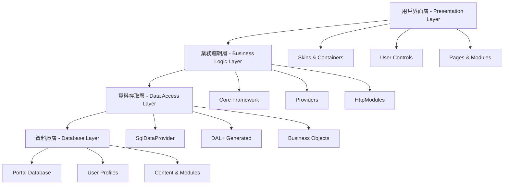

### 2.2 技術棧詳細

| 層級 | 技術 | 說明 |
|------|------|------|
| **前端層** | ASP.NET Web Forms | 網頁呈現框架 |
| | HTML/CSS/JavaScript | 前端標記與樣式 |
| | DNN Skins | 外觀主題系統 |
| **業務層** | VB.NET | 主要程式語言 |
| | .NET Framework 1.1 | 執行環境 |
| | DNN Core Framework | 核心框架 |
| **資料層** | SQL Server 2005 | 關聯式資料庫 |
| | SqlDataProvider | 資料存取提供者 |
| | Stored Procedures | 預存程序 |

---

## 3. 🏛️ 系統架構圖

### 3.1 整體系統架構

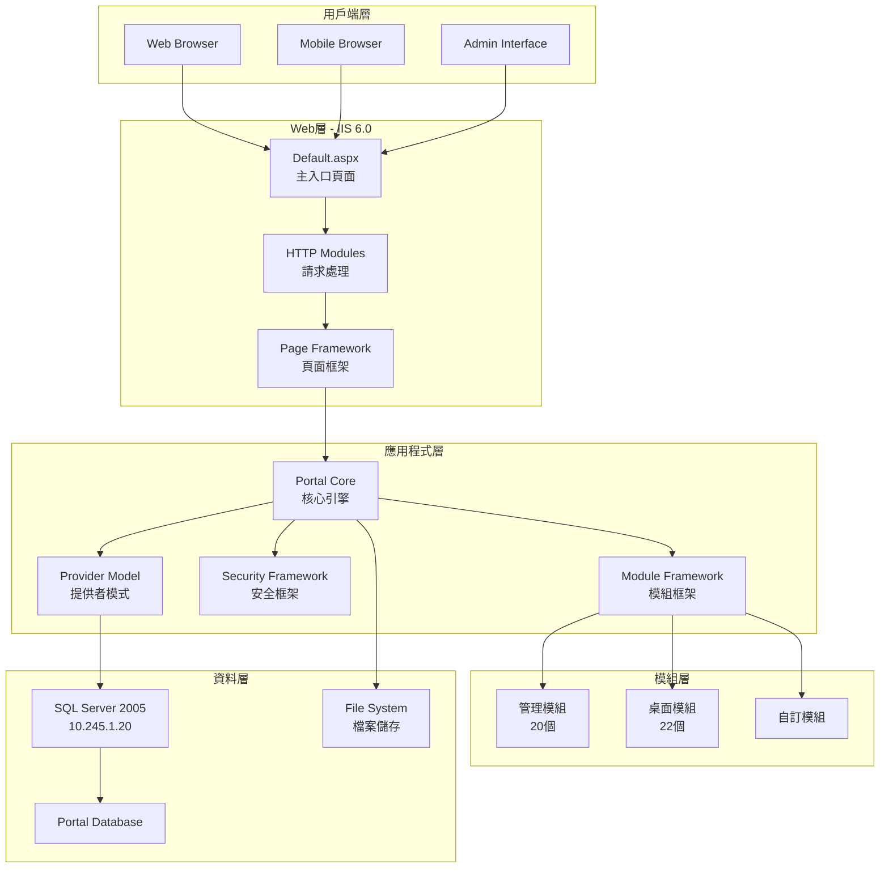

### 3.2 DNN核心架構

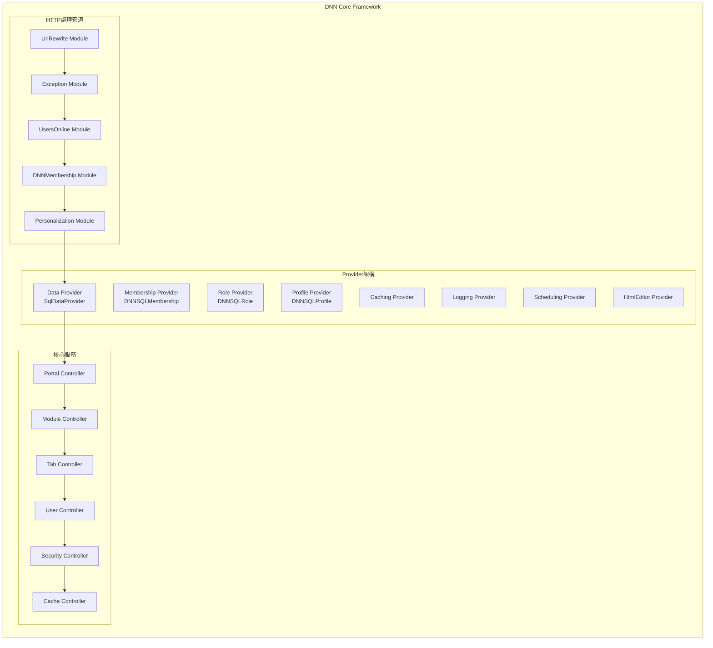

---

## 4. 🗄️ 資料庫架構

### 4.1 資料庫連線配置

**主要資料庫連線：**
- **伺服器：** 10.245.1.20
- **資料庫：** Portal
- **認證：** SQL Server Authentication (sa)

**連線字串：**
```xml
<add key="SiteSqlServer" value="Server=10.245.1.20;Database=Portal;uid=sa;pwd=;" />
```

### 4.2 核心資料表結構

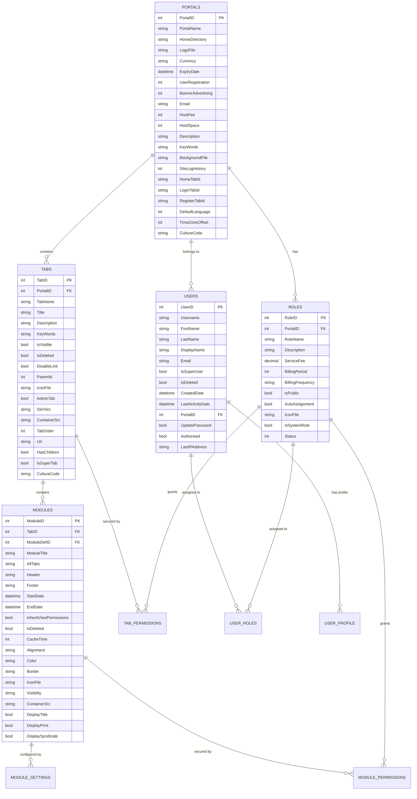

---

## 5. 🧩 模組架構

### 5.1 模組分類結構

```mermaid
graph TD
    A[DNN Portal 模組系統] --> B[管理模組 - 20個]
    A --> C[桌面模組 - 22個]
    A --> D[核心控制項]
    
    B --> B1[Container 管理]
    B --> B2[ControlPanel 控制面板]
    B --> B3[Files 檔案管理]
    B --> B4[Host 主機管理]
    B --> B5[Lists 清單管理]
    B --> B6[Localization 本地化]
    B --> B7[Log 日誌管理]
    B --> B8[Logging 記錄]
    B --> B9[ModuleDefinitions 模組定義]
    B --> B10[Modules 模組管理]
    B --> B11[Portal 入口管理]
    B --> B12[Sales 銷售]
    B --> B13[Scheduling 排程]
    B --> B14[Search 搜尋]
    B --> B15[Security 安全]
    B --> B16[Skins 外觀]
    B --> B17[Tabs 頁籤管理]
    B --> B18[Users 用戶管理]
    B --> B19[Vendors 廠商]
    B --> B20[Wizards 精靈]
    
    C --> C1[Announcements 公告]
    C --> C2[Contacts 聯絡人]
    C --> C3[Discussions 討論區]
    C --> C4[Documents 文件]
    C --> C5[Events 事件]
    C --> C6[FAQs 常見問題]
    C --> C7[Feedback 回饋]
    C --> C8[HitCounter 點擊計數]
    C --> C9[HTML 內容]
    C --> C10[IFrame 框架]
    C --> C11[Images 圖片]
    C --> C12[Links 連結]
    C --> C13[Messages 訊息]
    C --> C14[News 新聞]
    C --> C15[PageTitle 頁面標題]
    C --> C16[SearchInput 搜尋輸入]
    C --> C17[SearchResults 搜尋結果]
    C --> C18[Survey 調查]
    C --> C19[UserDefinedTable 用戶定義表]
    C --> C20[UserInformation 用戶資訊]
    C --> C21[UsersOnline 線上用戶]
    C --> C22[XML 資料]
```

### 5.2 核心模組功能

**內容管理模組：**
- **HTML模組** - 靜態內容編輯、Rich Text Editor、版本控制
- **Documents模組** - 檔案上傳下載、分類管理、權限控制
- **News模組** - 新聞發佈、RSS支援、分類標籤

**溝通協作模組：**
- **Discussions模組** - 主題討論、回覆管理、權限控制
- **Survey模組** - 問卷設計、結果統計、報表輸出
- **Feedback模組** - 用戶意見、郵件通知、管理回覆

**資訊展示模組：**
- **Announcements模組** - 重要通知、到期管理、目標用戶
- **Events模組** - 活動管理、日曆顯示、報名功能
- **Links模組** - 網站收藏、分類整理、點擊統計

---

## 6. 👤 用戶流程

### 6.1 用戶認證流程

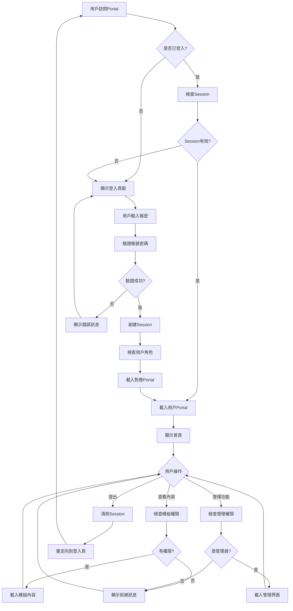

### 6.2 內容管理流程

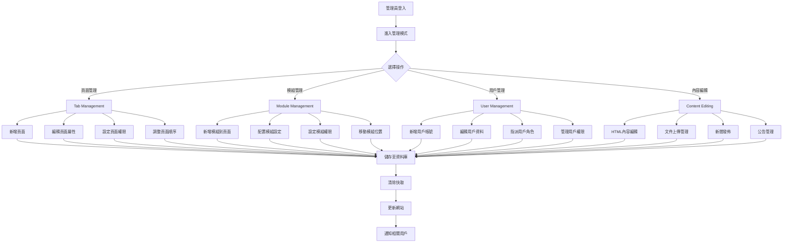

---

## 7. 🔒 安全架構

### 7.1 安全層級架構

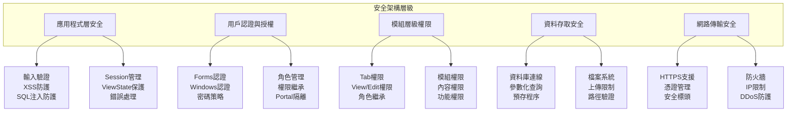

### 7.2 權限控制模型

**權限主體：** Users 用戶、Roles 角色、Groups 群組  
**權限對象：** Portal 入口、Tabs 頁面、Modules 模組、Content 內容  
**權限類型：** VIEW 檢視、EDIT 編輯、ADD 新增、DELETE 刪除、FULL 完整控制  

**特殊角色：**
- SuperUser 超級用戶 - 完整控制
- Administrator 管理員 - 編輯權限
- Registered Users 註冊用戶 - 檢視權限
- All Users 所有用戶 - 基本檢視權限

---

## 8. 🚀 部署架構

### 8.1 實體部署架構

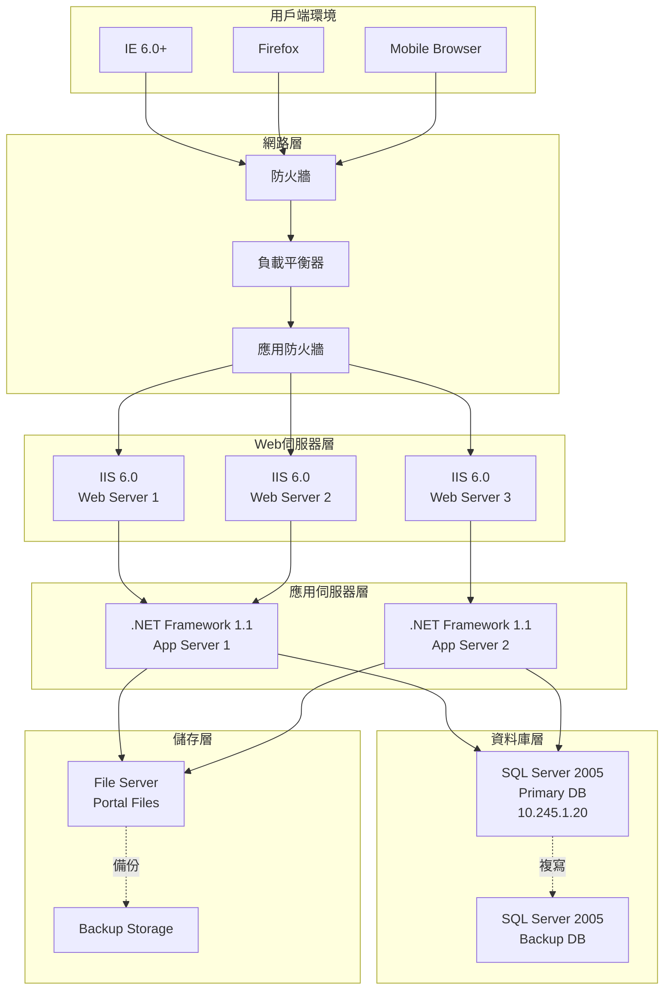

---

## 9. 🔌 API與整合

### 9.1 核心API設定

**Web.config 核心配置：**

```xml
<!-- DNN Provider Configuration -->
<dotnetnuke>
  <!-- Data Provider -->
  <data defaultProvider="SqlDataProvider">
    <providers>
      <add name="SqlDataProvider" 
           type="DotNetNuke.Data.SqlDataProvider, DotNetNuke.SqlDataProvider" 
           connectionStringName="SiteSqlServer" 
           objectQualifier="" 
           databaseOwner="dbo" />
    </providers>
  </data>
  
  <!-- Membership Provider -->
  <membership defaultProvider="DNNSQLMembershipProvider">
    <providers>
      <add name="DNNSQLMembershipProvider" 
           type="DotNetNuke.Security.Membership.DNNSQLMembershipProvider" 
           connectionStringName="SiteSqlServer" 
           enablePasswordRetrieval="true" 
           enablePasswordReset="true" 
           requiresQuestionAndAnswer="false" 
           minRequiredPasswordLength="3" />
    </providers>
  </membership>
</dotnetnuke>
```

---

## 10. ⚙️ 系統配置

### 10.1 重要設定參數

**應用程式設定：**
- **MachineValidationKey：** D05D587F9FD65EAA2F3CC51C51DE2FEF3DDF70C1
- **AutoUpgrade：** true
- **UseDnnConfig：** true
- **InstallMemberRole：** true
- **EnableWebFarmSupport：** false
- **EnableCachePersistence：** false
- **InstallationDate：** 9/18/2006

**全球化設定：**
- **Culture：** en-US
- **UICulture：** en
- **RequestEncoding：** UTF-8
- **ResponseEncoding：** UTF-8
- **FileEncoding：** UTF-8

### 10.2 檔案結構

**重要檔案路徑：**
- **應用程式根目錄：** `/Portal/`
- **桌面模組目錄：** `/DesktopModules/`
- **管理模組目錄：** `/admin/`
- **外觀目錄：** `/Portals/_default/Skins/`
- **容器目錄：** `/Portals/_default/Containers/`
- **上傳檔案：** `/Portals/0/`
- **設定檔案：** `web.config`

---

## 📊 效能指標

### 10.3 建議效能標準

- **頁面載入時間：** < 3 秒
- **並發用戶數：** 100-500 用戶
- **資料庫回應時間：** < 100ms
- **檔案上傳大小：** 最大 8MB
- **Session超時：** 60 分鐘

---

**文件結束**  
**最後更新：** 2025年1月27日  
**版本：** 1.0  
**維護者：** YKK IT部門

### 系統組成


### 技術棧詳細

| 層級 | 技術 | 說明 |
|------|------|------|
| **前端層** | ASP.NET Web Forms | 網頁呈現框架 |
| | HTML/CSS/JavaScript | 前端標記與樣式 |
| | DNN Skins | 外觀主題系統 |
| **業務層** | VB.NET | 主要程式語言 |
| | .NET Framework 1.1 | 執行環境 |
| | DNN Core Framework | 核心框架 |
| **資料層** | SQL Server 2005 | 關聯式資料庫 |
| | SqlDataProvider | 資料存取提供者 |
| | Stored Procedures | 預存程序 |

---

## 🏛️ 系統架構圖

### 整體系統架構


### DNN核心架構


---

## 🗄️ 資料庫架構

### 資料庫架構概述
```mermaid
erDiagram
    PORTALS ||--o{ TABS : "contains"
    PORTALS ||--o{ USERS : "belongs to"
    PORTALS ||--o{ ROLES : "has"
    
    TABS ||--o{ MODULES : "contains"
    TABS ||--o{ TAB_PERMISSIONS : "secured by"
    
    MODULES ||--o{ MODULE_SETTINGS : "configured by"
    MODULES ||--o{ MODULE_PERMISSIONS : "secured by"
    
    USERS ||--o{ USER_ROLES : "assigned to"
    USERS ||--o{ USER_PROFILE : "has profile"
    
    ROLES ||--o{ USER_ROLES : "assigned to"
    ROLES ||--o{ TAB_PERMISSIONS : "grants"
    ROLES ||--o{ MODULE_PERMISSIONS : "grants"
    
    PORTALS {
        int PortalID PK
        string PortalName
        string HomeDirectory
        string LogoFile
        string Currency
        datetime ExpiryDate
        int UserRegistration
        int BannerAdvertising
        string AdministratorId
        string Email
        int HostFee
        int HostSpace
        string PaymentProcessor
        string ProcessorUserId
        string ProcessorPassword
        string Description
        string KeyWords
        string BackgroundFile
        int SiteLogHistory
        string SplashTabId
        string HomeTabId
        string LoginTabId
        string RegisterTabId
        string UserTabId
        string SearchTabId
        string Custom404TabId
        string Custom500TabId
        int DefaultLanguage
        int TimeZoneOffset
        string AdminTabId
        int SuperTabId
        string CultureCode
    }
    
    TABS {
        int TabID PK
        int PortalID FK
        string TabName
        string Title
        string Description
        string KeyWords
        bool IsVisible
        bool IsDeleted
        bool DisableLink
        int ParentId
        string IconFile
        bool AdminTab
        int LeftPane
        int ContentPane
        int RightPane
        string SkinSrc
        string ContainerSrc
        int TabOrder
        string Url
        bool HasChildren
        bool IsSuperTab
        string CultureCode
    }
    
    MODULES {
        int ModuleID PK
        int TabID FK
        int ModuleDefID FK
        string ModuleTitle
        string AllTabs
        string Header
        string Footer
        datetime StartDate
        datetime EndDate
        string InheritViewPermissions
        bool IsDeleted
        int CacheTime
        string CacheMethod
        string Alignment
        string Color
        string Border
        string IconFile
        string Visibility
        string ContainerSrc
        bool DisplayTitle
        bool DisplayPrint
        bool DisplaySyndicate
        bool IsWebSlice
        string WebSliceTitle
        string WebSliceTTL
        datetime WebSliceExpiryDate
        int DesktopModuleID
        int CultureCode
    }
    
    USERS {
        int UserID PK
        string Username
        string FirstName
        string LastName
        string DisplayName
        string Email
        bool IsSuperUser
        bool IsDeleted
        int AffiliateId
        datetime CreatedDate
        datetime LastActivityDate
        int PortalID FK
        bool UpdatePassword
        bool Authorised
        string LastIPAddress
    }
    
    ROLES {
        int RoleID PK
        int PortalID FK
        string RoleName
        string Description
        decimal ServiceFee
        int BillingPeriod
        string BillingFrequency
        decimal TrialFee
        int TrialPeriod
        string TrialFrequency
        bool IsPublic
        bool AutoAssignment
        string RSVPCode
        string IconFile
        bool IsSystemRole
        int Status
    }
    
    USER_ROLES {
        int UserRoleID PK
        int UserID FK
        int RoleID FK
        datetime EffectiveDate
        datetime ExpiryDate
        bool IsTrialUsed
        bool IsOwner
    }
    
    MODULE_SETTINGS {
        int ModuleID FK
        string SettingName PK
        string SettingValue
    }
    
    TAB_PERMISSIONS {
        int TabPermissionID PK
        int TabID FK
        int PermissionID FK
        int RoleID FK
        int UserID FK
        bool AllowAccess
    }
    
    MODULE_PERMISSIONS {
        int ModulePermissionID PK
        int ModuleID FK
        int PermissionID FK
        int RoleID FK
        int UserID FK
        bool AllowAccess
    }
    
    USER_PROFILE {
        int ProfileID PK
        int UserID FK
        int PropertyDefinitionID FK
        string PropertyValue
        string Visibility
        datetime LastUpdatedDate
    }
```

### 資料庫連線配置
```xml
<!-- Portal Database Connection -->
<appSettings>
  <add key="SiteSqlServer" value="Server=10.245.1.20;Database=Portal;uid=sa;pwd=;" />
</appSettings>

<!-- Provider Configuration -->
<dotnetnuke>
  <data defaultProvider="SqlDataProvider">
    <providers>
      <add name="SqlDataProvider" 
           type="DotNetNuke.Data.SqlDataProvider, DotNetNuke.SqlDataProvider" 
           connectionStringName="SiteSqlServer" 
           objectQualifier="" 
           databaseOwner="dbo" />
    </providers>
  </data>
</dotnetnuke>
```

---

## 🧩 模組架構

### 模組分類結構


### 核心模組功能
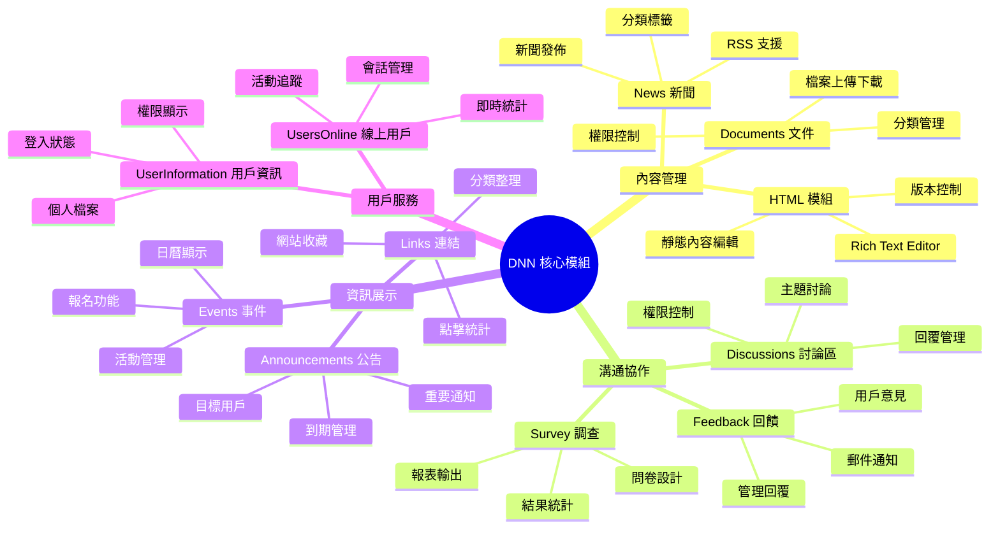

### 模組生命周期
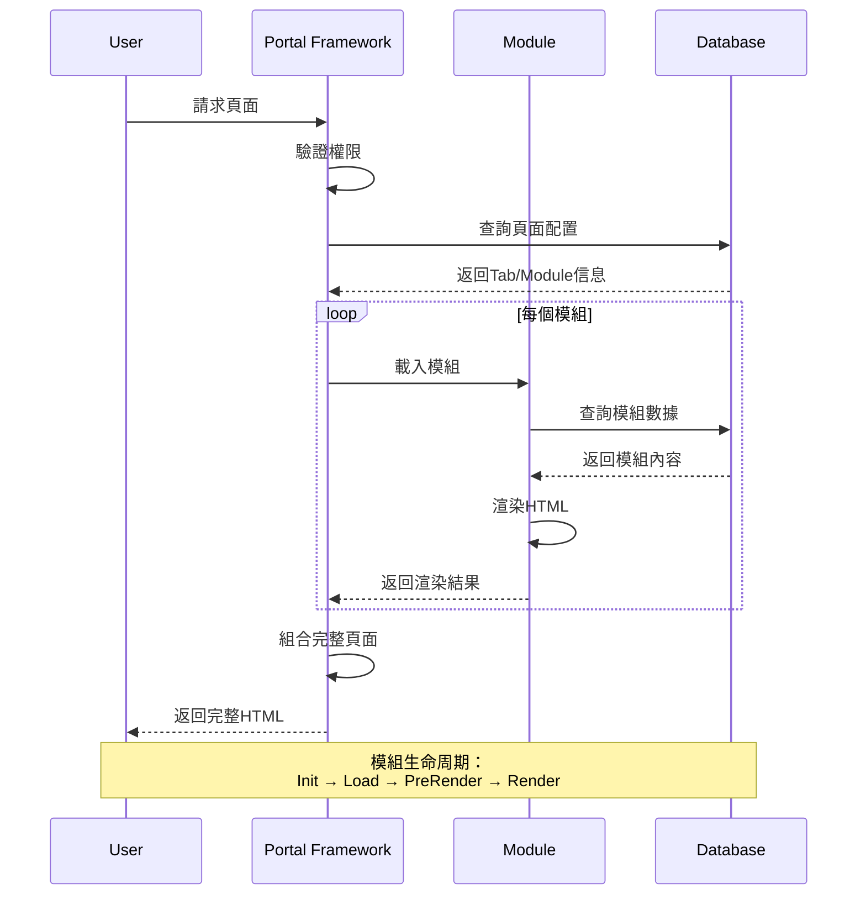

---

## 👤 用戶流程

### 用戶認證流程


### 內容管理流程


### 模組互動流程
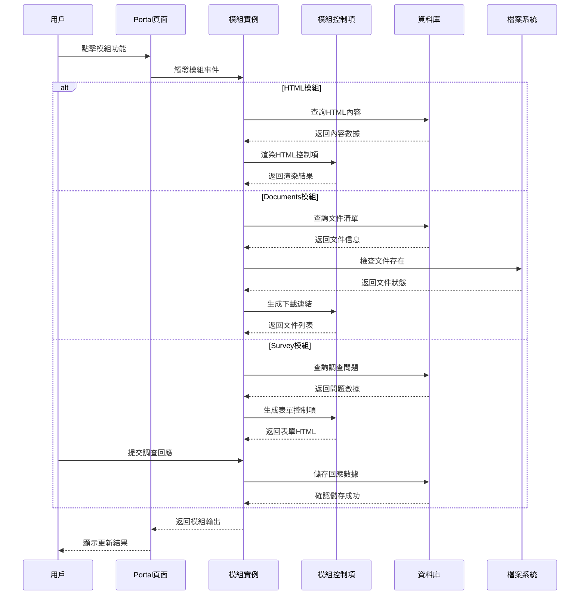

---

## 🔒 安全架構

### 安全層級架構


### 權限控制模型
```mermaid
graph LR
    subgraph "權限主體"
        U[Users 用戶]
        R[Roles 角色]
        G[Groups 群組]
    end
    
    subgraph "權限對象"
        P[Portal 入口]
        T[Tabs 頁面]
        M[Modules 模組]
        C[Content 內容]
    end
    
    subgraph "權限類型"
        V[VIEW 檢視]
        E[EDIT 編輯]
        A[ADD 新增]
        D[DELETE 刪除]
        F[FULL 完整控制]
    end
    
    subgraph "特殊角色"
        SA[SuperUser 超級用戶]
        AD[Administrator 管理員]
        RU[Registered Users 註冊用戶]
        AU[All Users 所有用戶]
    end
    
    U -.->|belongs to| R
    R -.->|contains| G
    
    U -->|granted| V
    R -->|granted| E
    G -->|granted| A
    
    P -->|secured by| V
    T -->|secured by| E
    M -->|secured by| A
    C -->|secured by| D
    
    SA -->|has| F
    AD -->|has| E
    RU -->|has| V
    AU -->|has| V
```

### 認證授權流程
```mermaid
sequenceDiagram
    participant U as 用戶
    participant A as 認證模組
    participant R as 角色管理
    participant P as 權限檢查
    participant M as 模組載入
    
    U->>A: 提供認證資訊
    A->>A: 驗證用戶帳密
    
    alt 認證成功
        A->>R: 查詢用戶角色
        R-->>A: 返回角色清單
        A->>A: 建立安全主體
        A->>A: 創建認證票證
        
        U->>P: 請求存取資源
        P->>P: 檢查用戶權限
        
        alt 有權限
            P->>M: 允許模組載入
            M-->>U: 返回資源內容
        else 無權限
            P-->>U: 拒絕存取 (401/403)
        end
        
    else 認證失敗
        A-->>U: 認證失敗訊息
    end
    
    Note over U,M: 權限檢查包括：<br/>Portal權限、Tab權限、Module權限
```

---

## 🚀 部署架構

### 實體部署架構
```mermaid
graph TB
    subgraph "用戶端環境"
        C1[IE 6.0+]
        C2[Firefox]
        C3[Mobile Browser]
    end
    
    subgraph "網路層"
        F1[防火牆]
        LB[負載平衡器]
        F2[應用防火牆]
    end
    
    subgraph "Web伺服器層"
        WS1[IIS 6.0<br/>Web Server 1]
        WS2[IIS 6.0<br/>Web Server 2]
        WS3[IIS 6.0<br/>Web Server 3]
    end
    
    subgraph "應用伺服器層"
        AS1[.NET Framework 1.1<br/>App Server 1]
        AS2[.NET Framework 1.1<br/>App Server 2]
    end
    
    subgraph "資料庫層"
        DB1[SQL Server 2005<br/>Primary DB<br/>10.245.1.20]
        DB2[SQL Server 2005<br/>Backup DB]
    end
    
    subgraph "儲存層"
        FS1[File Server<br/>Portal Files]
        FS2[Backup Storage]
    end
    
    C1 --> F1
    C2 --> F1
    C3 --> F1
    
    F1 --> LB
    LB --> F2
    
    F2 --> WS1
    F2 --> WS2
    F2 --> WS3
    
    WS1 --> AS1
    WS2 --> AS1
    WS3 --> AS2
    
    AS1 --> DB1
    AS2 --> DB1
    
    DB1 -.->|複寫| DB2
    
    AS1 --> FS1
    AS2 --> FS1
    FS1 -.->|備份| FS2
```

### 環境配置
```mermaid
graph LR
    subgraph "開發環境"
        DEV[Development<br/>單機部署<br/>SQLExpress<br/>Debug Mode]
    end
    
    subgraph "測試環境"
        TEST[Testing<br/>雙機部署<br/>SQL Server<br/>Mirror Mode]
    end
    
    subgraph "預生產環境"
        STAGE[Staging<br/>完整架構<br/>效能測試<br/>Release Mode]
    end
    
    subgraph "生產環境"
        PROD[Production<br/>負載平衡<br/>高可用性<br/>監控告警]
    end
    
    DEV -->|代碼提交| TEST
    TEST -->|測試通過| STAGE
    STAGE -->|驗收完成| PROD
    
    PROD -.->|熱修復| STAGE
    STAGE -.->|回歸測試| TEST
```

---

## 🔌 API與整合

### 系統整合架構
```mermaid
graph TB
    subgraph "DNN Portal"
        direction TB
        P1[Portal Core]
        P2[Module Framework]
        P3[Provider Model]
    end
    
    subgraph "外部系統整合"
        direction TB
        E1[LDAP/AD<br/>用戶認證]
        E2[Email System<br/>郵件服務]
        E3[File Server<br/>檔案儲存]
        E4[Database<br/>資料同步]
    end
    
    subgraph "Web服務"
        direction TB
        WS1[Portal Web Services]
        WS2[Module Web Services]
        WS3[User Web Services]
    end
    
    subgraph "第三方元件"
        direction TB
        T1[FreeTextBox<br/>編輯器]
        T2[Telerik Components]
        T3[Crystal Reports]
        T4[File Upload Controls]
    end
    
    P1 --> E1
    P1 --> E2
    P2 --> E3
    P3 --> E4
    
    P1 --> WS1
    P2 --> WS2
    P1 --> WS3
    
    P2 --> T1
    P2 --> T2
    P2 --> T3
    P2 --> T4
```

### Web Services API
```mermaid
sequenceDiagram
    participant C as 外部應用
    participant W as Web Service
    participant P as Portal Core
    participant D as Database
    
    C->>W: SOAP請求 (GetPortalInfo)
    W->>W: 驗證認證資訊
    W->>P: 調用Portal API
    P->>D: 查詢Portal資料
    D-->>P: 返回Portal信息
    P-->>W: 返回API結果
    W->>W: 序列化為SOAP
    W-->>C: SOAP回應
    
    Note over C,D: 支援的Web Services:<br/>- Portal Management<br/>- User Management<br/>- Content Management<br/>- Module Integration
```

---

## ⚙️ 系統配置

### Web.config 核心配置
```xml
<configuration>
  <!-- DNN Provider Configuration -->
  <dotnetnuke>
    <!-- Data Provider -->
    <data defaultProvider="SqlDataProvider">
      <providers>
        <add name="SqlDataProvider" 
             type="DotNetNuke.Data.SqlDataProvider, DotNetNuke.SqlDataProvider" 
             connectionStringName="SiteSqlServer" 
             objectQualifier="" 
             databaseOwner="dbo" />
      </providers>
    </data>
    
    <!-- Membership Provider -->
    <membership defaultProvider="DNNSQLMembershipProvider">
      <providers>
        <add name="DNNSQLMembershipProvider" 
             type="DotNetNuke.Security.Membership.DNNSQLMembershipProvider" 
             connectionStringName="SiteSqlServer" 
             enablePasswordRetrieval="true" 
             enablePasswordReset="true" 
             requiresQuestionAndAnswer="false" 
             minRequiredPasswordLength="3" />
      </providers>
    </membership>
    
    <!-- Role Provider -->
    <roleManager defaultProvider="DNNSQLRoleProvider">
      <providers>
        <add name="DNNSQLRoleProvider" 
             type="DotNetNuke.Security.Role.DNNSQLRoleProvider" 
             connectionStringName="SiteSqlServer" />
      </providers>
    </roleManager>
    
    <!-- Caching Provider -->
    <caching defaultProvider="FileBasedCachingProvider">
      <providers>
        <add name="FileBasedCachingProvider" 
             type="DotNetNuke.Services.Cache.FileBasedCachingProvider" />
      </providers>
    </caching>
  </dotnetnuke>
  
  <!-- HTTP Modules -->
  <httpModules>
    <add name="UrlRewrite" 
         type="DotNetNuke.HttpModules.UrlRewriteModule" />
    <add name="Exception" 
         type="DotNetNuke.HttpModules.ExceptionModule" />
    <add name="UsersOnline" 
         type="DotNetNuke.HttpModules.UsersOnlineModule" />
    <add name="DNNMembership" 
         type="DotNetNuke.HttpModules.DNNMembershipModule" />
    <add name="Personalization" 
         type="DotNetNuke.HttpModules.PersonalizationModule" />
  </httpModules>
</configuration>
```

### 系統參數配置
```mermaid
graph LR
    subgraph "Portal設定"
        PS1[Portal Name<br/>Logo & Theme]
        PS2[Language & Culture<br/>Time Zone]
        PS3[User Registration<br/>Security Policy]
        PS4[Payment & Hosting<br/>Expiry Settings]
    end
    
    subgraph "Module設定"
        MS1[Module Definitions<br/>Control Sources]
        MS2[Module Settings<br/>Custom Properties]
        MS3[Module Permissions<br/>Role Access]
        MS4[Module Caching<br/>Performance]
    end
    
    subgraph "User設定"
        US1[Profile Properties<br/>Custom Fields]
        US2[Role Assignments<br/>Permissions]
        US3[Authentication<br/>Password Policy]
        US4[User Preferences<br/>Personalization]
    end
    
    subgraph "System設定"
        SS1[Host Settings<br/>Global Config]
        SS2[Scheduler Tasks<br/>Automated Jobs]
        SS3[Log Settings<br/>Error Handling]
        SS4[Cache Settings<br/>Performance]
    end
```

---

## 📊 效能監控

### 系統監控架構
```mermaid
graph TB
    subgraph "監控層級"
        M1[應用效能監控<br/>APM]
        M2[資料庫效能監控<br/>Database Monitoring]
        M3[系統資源監控<br/>Server Monitoring]
        M4[用戶體驗監控<br/>UX Monitoring]
    end
    
    subgraph "監控指標"
        KPI1[回應時間<br/>Page Load Time]
        KPI2[並發用戶數<br/>Concurrent Users]
        KPI3[錯誤率<br/>Error Rate]
        KPI4[資源使用率<br/>Resource Usage]
    end
    
    subgraph "告警機制"
        A1[即時告警<br/>Real-time Alerts]
        A2[郵件通知<br/>Email Notification]
        A3[SMS通知<br/>SMS Alert]
        A4[日誌記錄<br/>Log Recording]
    end
    
    M1 --> KPI1
    M2 --> KPI2
    M3 --> KPI3
    M4 --> KPI4
    
    KPI1 --> A1
    KPI2 --> A2
    KPI3 --> A3
    KPI4 --> A4
```

---

## 📈 擴展性規劃

### 水平擴展架構
```mermaid
graph TB
    subgraph "負載平衡層"
        LB[負載平衡器<br/>Round Robin]
    end
    
    subgraph "Web伺服器集群"
        WS1[Web Server 1<br/>IIS + DNN]
        WS2[Web Server 2<br/>IIS + DNN]
        WS3[Web Server N<br/>IIS + DNN]
    end
    
    subgraph "共享儲存"
        SS1[NFS/SAN<br/>共享檔案系統]
        SS2[Session Store<br/>Redis/SQL]
    end
    
    subgraph "資料庫集群"
        DB1[主資料庫<br/>SQL Server]
        DB2[讀取副本<br/>Read Replica]
        DB3[備份資料庫<br/>Backup DB]
    end
    
    LB --> WS1
    LB --> WS2
    LB --> WS3
    
    WS1 --> SS1
    WS2 --> SS1
    WS3 --> SS1
    
    WS1 --> SS2
    WS2 --> SS2
    WS3 --> SS2
    
    WS1 --> DB1
    WS2 --> DB1
    WS3 --> DB2
    
    DB1 -.->|複寫| DB2
    DB1 -.->|備份| DB3
```

---

## 🔧 維護指南

### 日常維護流程
```mermaid
flowchart TD
    A[每日維護檢查] --> B[系統健康檢查]
    A --> C[備份狀態檢查]
    A --> D[日誌檔案檢查]
    A --> E[效能指標檢查]
    
    B --> B1{系統正常?}
    B1 -->|否| B2[調查問題原因]
    B1 -->|是| F[週期維護檢查]
    B2 --> B3[修復問題]
    B3 --> B4[測試驗證]
    B4 --> F
    
    C --> C1{備份成功?}
    C1 -->|否| C2[重新執行備份]
    C1 -->|是| F
    C2 --> C3[檢查備份設定]
    C3 --> F
    
    D --> D1{有錯誤?}
    D1 -->|是| D2[分析錯誤日誌]
    D1 -->|否| F
    D2 --> D3[修復相關問題]
    D3 --> F
    
    E --> E1{效能正常?}
    E1 -->|否| E2[效能調優]
    E1 -->|是| F
    E2 --> E3[監控改善結果]
    E3 --> F
    
    F --> G[每週維護檢查]
    G --> H[每月維護檢查]
    H --> I[季度維護檢查]
    I --> J[年度維護檢查]
```

---

## 📚 附錄

### A. 系統需求
- **作業系統：** Windows Server 2003/2008
- **Web伺服器：** IIS 6.0 或以上
- **資料庫：** SQL Server 2005 或以上
- **執行環境：** .NET Framework 1.1/2.0
- **瀏覽器：** IE 6.0+, Firefox 1.5+

### B. 資料庫表格清單
- **Portal相關：** Portals, PortalSettings
- **用戶管理：** Users, UserRoles, Roles, UserProfile
- **頁面管理：** Tabs, TabPermissions
- **模組管理：** Modules, ModuleDefinitions, ModuleSettings
- **內容管理：** HtmlText, Files, Links
- **系統管理：** HostSettings, EventLog, Schedule

### C. 重要檔案路徑
- **應用程式根目錄：** `/Portal/`
- **模組目錄：** `/DesktopModules/` `/admin/`
- **外觀目錄：** `/Portals/_default/Skins/` `/Portals/_default/Containers/`
- **上傳檔案：** `/Portals/0/` `/Portals/_default/`
- **設定檔案：** `web.config` `dnn.config`

---

**文件結束**  
**最後更新：** 2025年1月27日  
**版本：** 1.0  
**維護者：** YKK IT部門 