# WorkFlow 與 VS2005 企業系統 - 系統規格書

## 1. 系統概述

### 1.1 系統簡介
本規格書涵蓋 YKK 企業的兩大核心業務系統：
- **WorkFlow 系統**：VS2003 版本的企業工作流程管理系統
- **VS2005 系統群**：包含 24 個子系統的大型企業應用程式群組

### 1.2 技術概要
| 系統 | 技術棧 | 檔案數量 | 主要功能 |
|------|--------|----------|----------|
| WorkFlow | ASP.NET 1.1 + VB.NET + SQL Server | 920個 | 製造業流程管理 |
| VS2005 | ASP.NET 2.0 + VB.NET + SQL Server | 2,762個 | 企業管理系統群 |

## 2. WorkFlow 系統詳細分析

### 2.1 系統架構

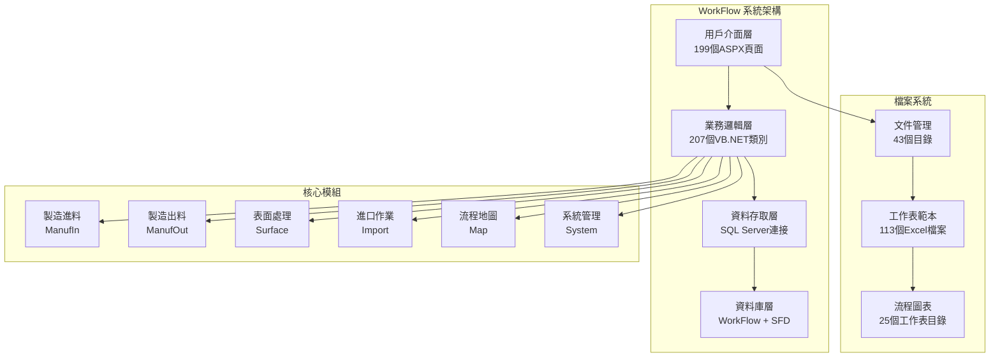

### 2.2 資料庫架構

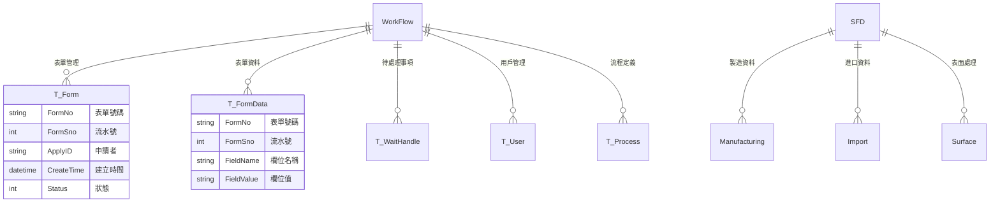

### 2.3 檔案結構分析

#### 程式檔案 (610個，66.3%)
| 檔案類型 | 數量 | 用途 |
|----------|------|------|
| .aspx | 199 | 用戶介面頁面 |
| .vb | 207 | 業務邏輯程式碼 |
| .resx | 200 | 資源檔案 |
| .config | 4 | 系統配置 |

#### 非程式檔案 (310個，33.7%)
| 檔案類型 | 數量 | 用途 |
|----------|------|------|
| .xls/.xlsx | 113 | Excel範本與流程圖 |
| 圖像檔案 | 165 | UI圖示與圖表 |
| 文件檔案 | 8 | 說明文件 |
| 其他 | 24 | 專案檔案與其他 |

### 2.4 核心功能模組

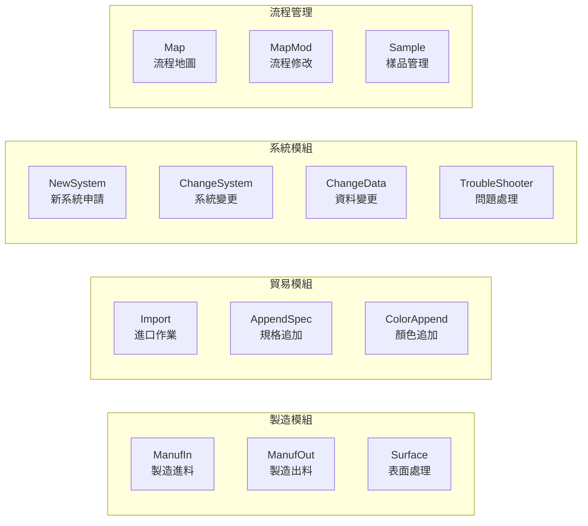

### 2.5 工作流程

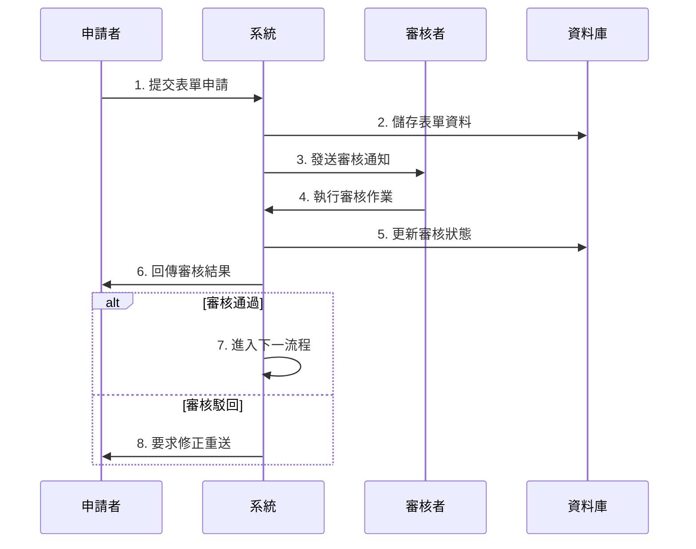

## 3. VS2005 系統群詳細分析

### 3.1 系統架構總覽

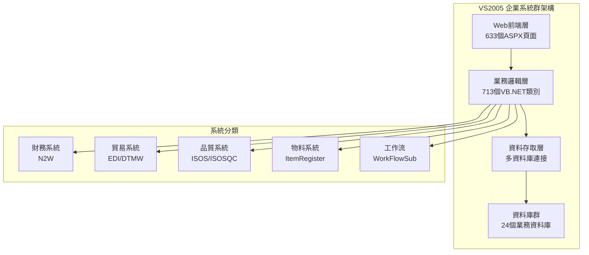

### 3.2 主要子系統分析

#### 3.2.1 N2W (報銷系統) - 120 個頁面
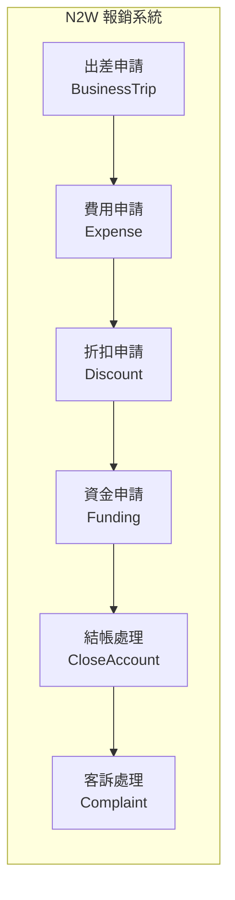

**核心功能：**
- 出差費用管理 (BusinessTripSheet_01-03.aspx)
- 費用核銷處理 (ExpenseSheet_01-03.aspx)
- 折扣管理 (DiscountSheet_01-02.aspx)
- 資金申請 (FundingSheet_01-03.aspx)
- 結帳作業 (CloseAccountSheet_01-03.aspx)

#### 3.2.2 EDI (電子資料交換) - 68 個頁面
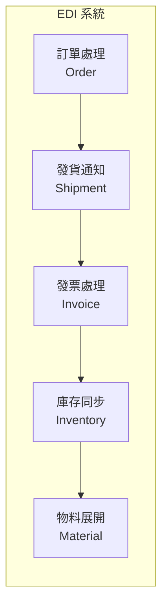

**系統特色：**
- 與 WAVES 系統整合
- 支援多種 EDI 格式 (TNF, ADIDAS, REEBOK)
- 自動物料展開功能
- 批次處理與監控

#### 3.2.3 DTMW (染料管理) - 65 個頁面
專門用於染料相關的製造流程管理。

#### 3.2.4 ISOSQC (ISO品質控制) - 61 個頁面
實施 ISO 品質管理標準的專業系統。

### 3.3 檔案統計分析

#### 總體統計
- **總檔案數：** 2,762 個
- **程式檔案：** 1,377 個 (49.9%)
- **非程式檔案：** 1,385 個 (50.1%)

#### 檔案類型分佈
| 類型 | 數量 | 百分比 | 用途 |
|------|------|--------|------|
| .vb | 713 | 25.8% | VB.NET 程式碼 |
| .aspx | 633 | 22.9% | Web 頁面 |
| 圖像檔案 | 686 | 24.8% | UI 圖示與圖表 |
| .xls/.xlsx | 233 | 8.4% | Excel 範本 |
| .dll | 123 | 4.5% | 程式庫 |
| .config | 31 | 1.1% | 設定檔案 |
| 其他 | 343 | 12.5% | 文件與其他 |

### 3.4 系統整合架構

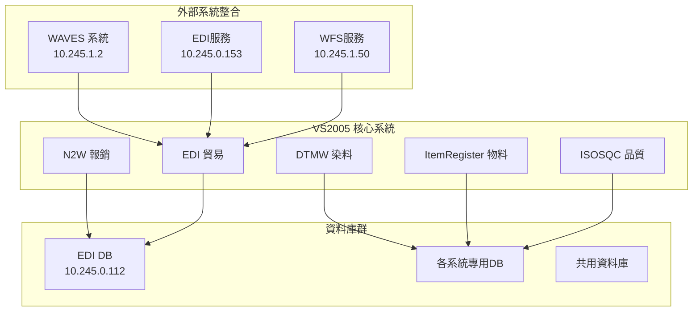

## 4. 技術架構比較

### 4.1 技術棧對比
| 項目 | WorkFlow | VS2005 |
|------|----------|---------|
| .NET Framework | 1.1 | 2.0 |
| 開發工具 | VS2003 | VS2005 |
| 語言 | VB.NET | VB.NET |
| 資料庫 | SQL Server | SQL Server |
| 認證方式 | Windows | Windows |
| 部署方式 | IIS 6.0 | IIS 6.0 |

### 4.2 系統複雜度分析

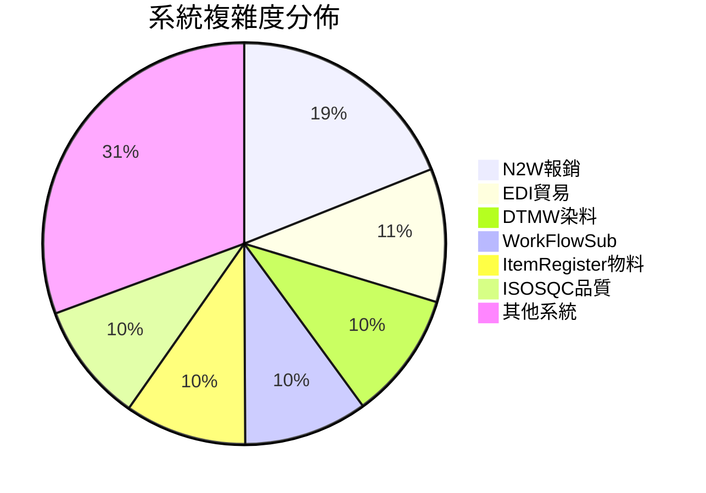

## 5. 部署架構

### 5.1 網路架構

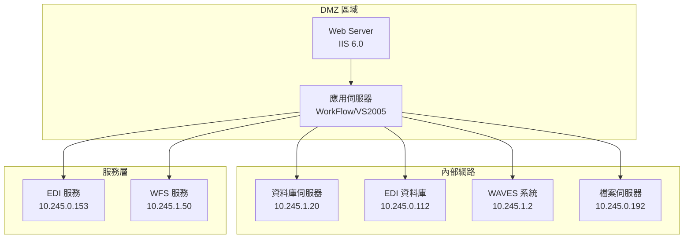

### 5.2 資料流架構

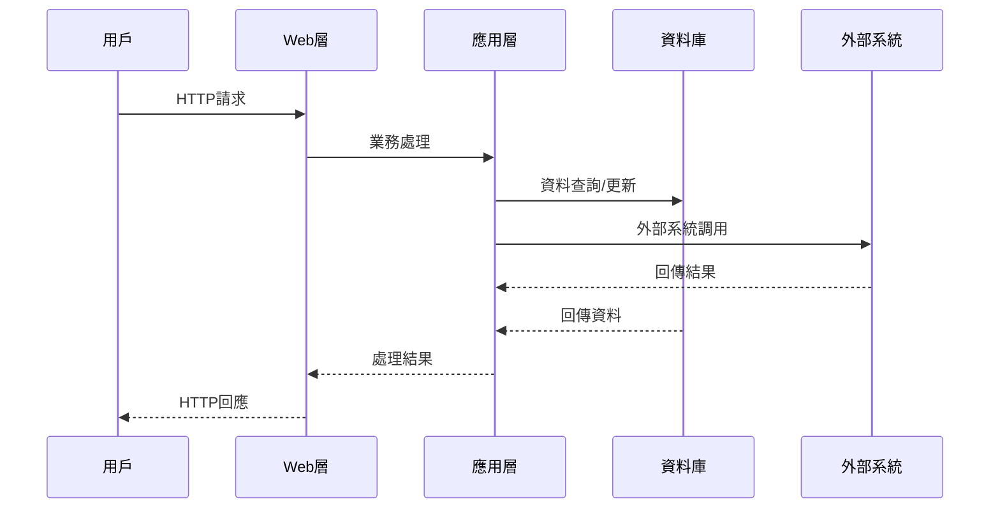

## 6. 安全架構

### 6.1 認證與授權

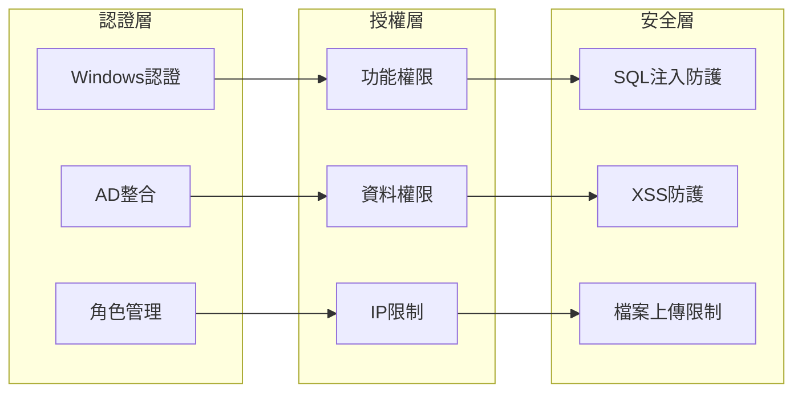

### 6.2 資料安全
- **資料庫加密：** 使用 SQL Server 內建加密
- **傳輸加密：** SSL/HTTPS 保護
- **存取控制：** Windows 認證 + 角色管理
- **稽核記錄：** 完整的操作日誌

## 7. 效能與擴展性

### 7.1 效能指標
| 系統 | 同時用戶數 | 回應時間 | 資料量 |
|------|------------|----------|--------|
| WorkFlow | 50-100 | < 3秒 | 中等 |
| VS2005 | 200-500 | < 2秒 | 大量 |

### 7.2 擴展策略

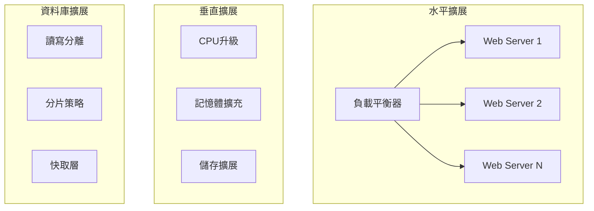

## 8. 維護與監控

### 8.1 系統監控

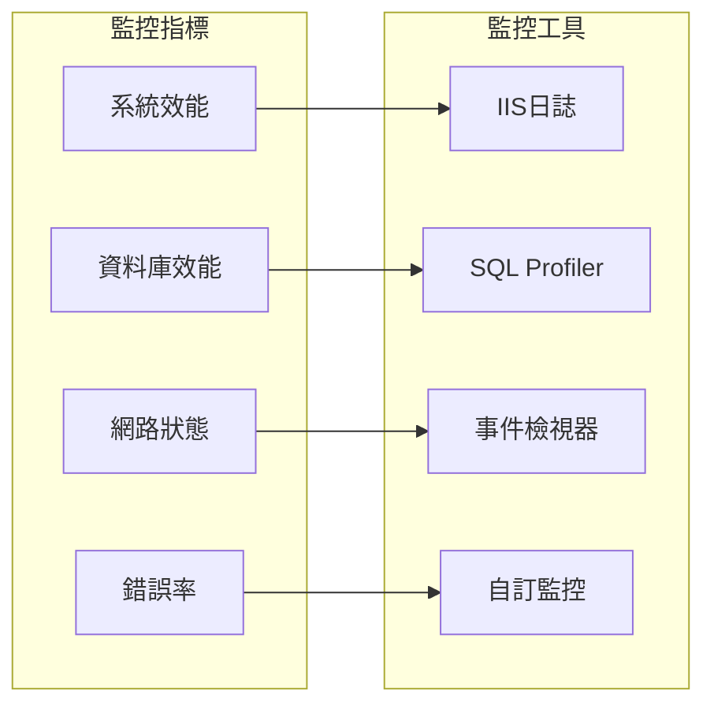

### 8.2 備份策略
- **資料庫備份：** 每日完整備份 + 每小時增量備份
- **檔案備份：** 每週完整備份
- **設定備份：** 變更時即時備份
- **異地備援：** 重要資料異地存放

## 9. 升級建議

### 9.1 技術債務
1. **框架老舊：** .NET Framework 1.1/2.0 已停止支援
2. **安全風險：** 老舊技術存在安全漏洞
3. **維護困難：** 開發人員稀少
4. **擴展限制：** 無法利用現代化功能

### 9.2 現代化路徑

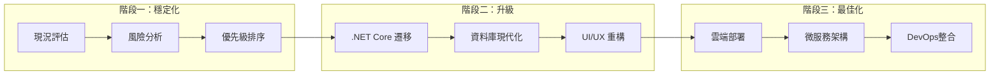

### 9.3 建議技術棧
- **後端：** .NET 6/8 + C#
- **前端：** React/Vue.js + TypeScript
- **資料庫：** SQL Server 2022 + Redis
- **部署：** Docker + Kubernetes
- **雲端：** Azure/AWS

## 10. 總結

### 10.1 系統評估
| 項目 | WorkFlow | VS2005 | 評分 |
|------|----------|---------|------|
| 功能完整性 | ★★★★☆ | ★★★★★ | 4.5/5 |
| 技術先進性 | ★★☆☆☆ | ★★☆☆☆ | 2/5 |
| 維護難度 | ★★★☆☆ | ★★★★☆ | 3.5/5 |
| 安全性 | ★★★☆☆ | ★★★☆☆ | 3/5 |
| 擴展性 | ★★☆☆☆ | ★★★☆☆ | 2.5/5 |

### 10.2 關鍵發現
1. **業務價值高：** 兩系統都是企業核心業務支援系統
2. **技術債務重：** 使用過時技術，存在安全與維護風險
3. **整合複雜：** 系統間依賴關係複雜，升級需謹慎規劃
4. **資料豐富：** 累積大量業務資料，遷移需完整規劃

### 10.3 建議行動
1. **短期：** 安全性修補、效能優化、監控強化
2. **中期：** 逐步遷移至 .NET Core、資料庫升級
3. **長期：** 微服務重構、雲端化部署、現代化UI

---

**文件版本：** 1.0  
**建立日期：** 2025/01/24  
**更新日期：** 2025/01/24  
**文件狀態：** 初版完成 