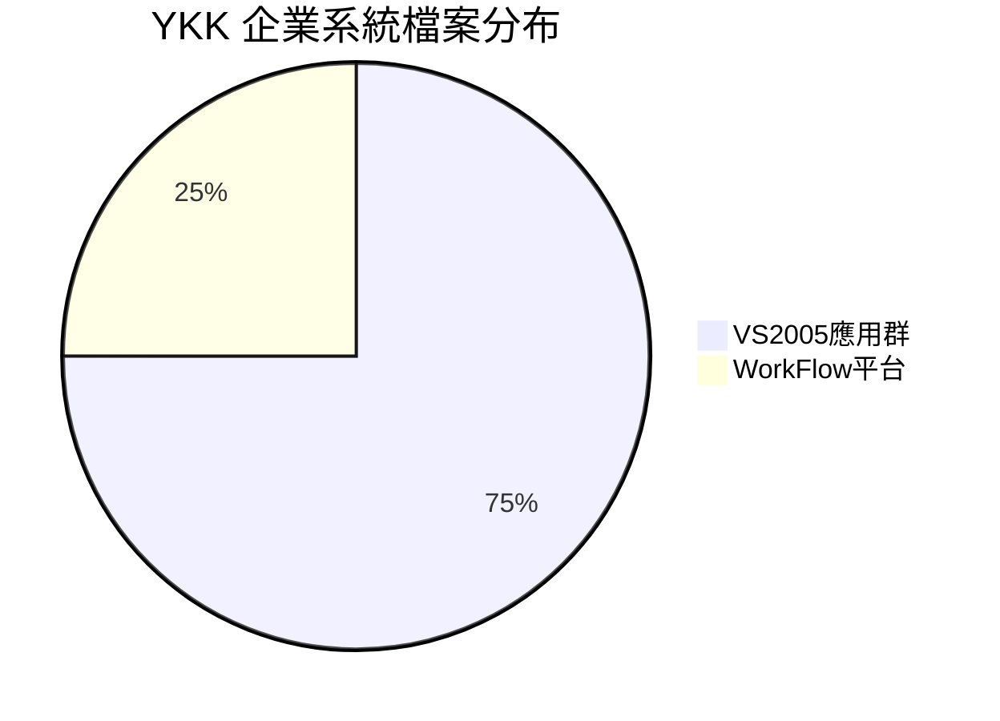
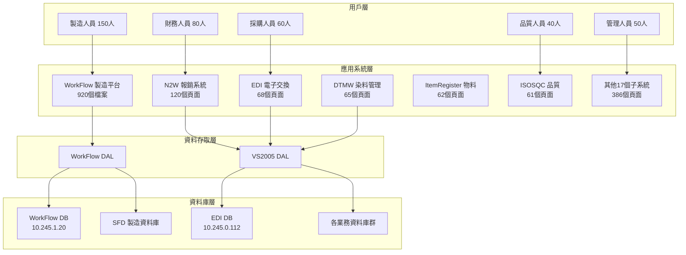
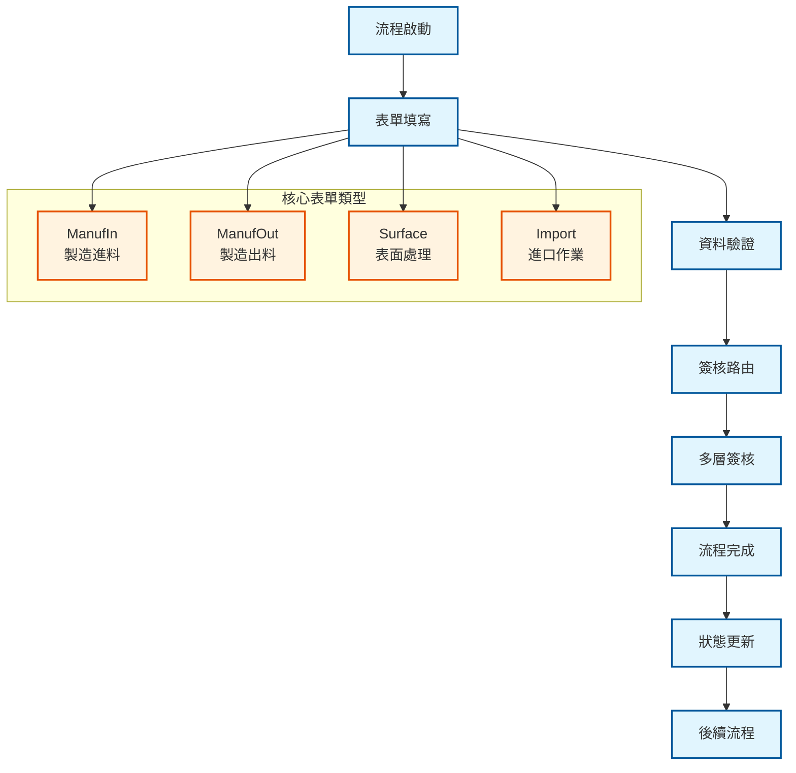
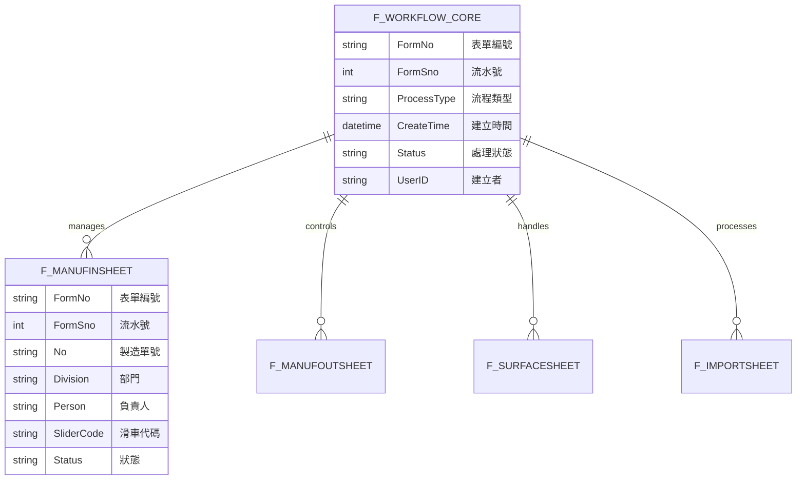
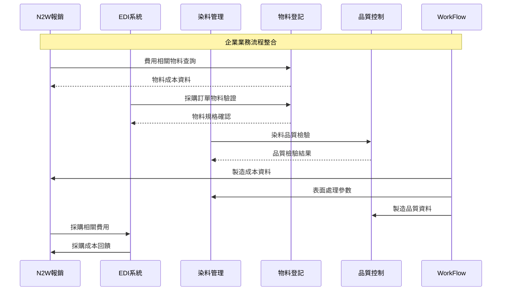
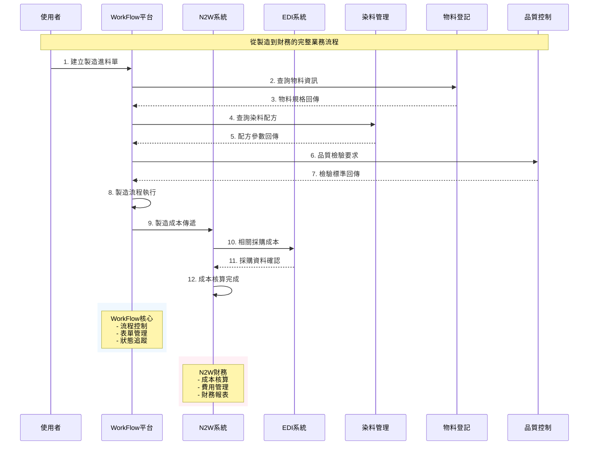
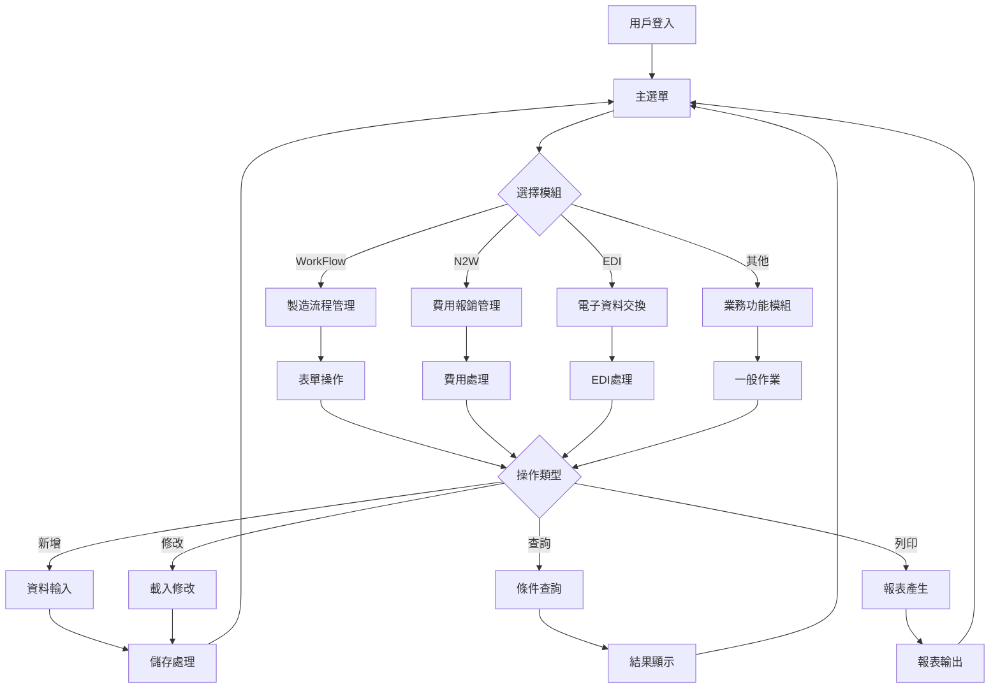

# YKK 企業系統統一規格說明書

## 📋 文件資訊
- **系統名稱**: YKK 企業資源規劃統一系統
- **版本**: v1.0 (規格專注版)
- **建立日期**: 2025-01-28
- **維護單位**: 系統架構組
- **文件目的**: 系統功能與技術規格完整說明

---

# 🎯 系統概述

## 基本資訊

**YKK 企業統一系統**是一個基於 .NET Framework 的企業資源規劃系統，由兩大核心平台組成，使用 ASP.NET Web Forms + VB.NET 開發，服務企業核心營運超過 15 年。系統涵蓋製造流程管理、財務管理、供應鏈管理、品質控制等完整業務功能。

## 📊 系統規模

| 項目 | 數量 | 說明 |
|------|------|------|
| **總檔案數** | **3,682** 個 | 兩平台總和 |
| **ASPX 頁面** | **832** 個 | Web 用戶介面 |
| **VB.NET 程式** | **920** 個 | 核心業務邏輯程式 |
| **子系統數** | **25** 個 | 完整業務模組 |
| **開發週期** | **5年** | 2003-2008 持續開發 |
| **平台數量** | **2** 個 | WorkFlow + VS2005 |

## 📈 雙平台分布



| 平台 | 檔案數量 | 百分比 | 主要功能 |
|------|----------|--------|----------|
| **VS2005應用群** | 2,762 | 75.0% | 企業業務管理、財務、供應鏈 |
| **WorkFlow平台** | 920 | 25.0% | 製造流程管理、工作流程引擎 |
| **總計** | **3,682** | **100%** | **完整企業系統** |

---

# 🏗️ 技術架構

## 系統架構層次



## 核心技術規格

### 🖥️ 開發環境
- **WorkFlow 平台**: Visual Studio 2003, .NET Framework 1.1
- **VS2005 應用群**: Visual Studio 2005, .NET Framework 2.0
- **Web 伺服器**: IIS 6.0
- **認證方式**: Windows 認證

### 💼 中介軟體
- **ASP.NET Web Forms**: 用戶介面框架
- **ADO.NET**: 資料存取技術
- **Web Services**: 系統間整合 (ASMX)
- **Session State**: InProc 模式

### 🗄️ 資料庫系統
- **SQL Server 2000/2005**: 主要資料庫系統
- **多資料庫架構**: 各子系統獨立資料庫
- **連接方式**: SQL Server 認證 + Windows 認證

### 🛠️ 開發語言
- **VB.NET**: 主要開發語言 (100%)
- **JavaScript**: 前端腳本
- **T-SQL**: 資料庫腳本

---

# 📦 兩大平台詳細規格

## 1️⃣ WorkFlow 平台 (製造流程管理) - 920個檔案

### 🎯 平台目的
製造流程自動化管理，工作流程引擎，表單管理，簽核流程控制

### 📁 主要模組

#### 製造進料模組 (ManufIn)
- **功能**: 原料進料流程管理、物料清單控制、進料檢驗
- **主要程式**: ManufInSheet系列、ManufInList系列
- **資料表**: F_ManufInSheet、F_ManufInList

#### 製造出料模組 (ManufOut)
- **功能**: 成品出料流程管理、生產排程、出貨控制
- **主要程式**: ManufOutSheet系列、ManufOutList系列
- **資料表**: F_ManufOutSheet、F_ManufOutList

#### 表面處理模組 (Surface)
- **功能**: 產品表面處理工藝管理、參數控制、品質標準
- **主要程式**: SurfaceSheet系列
- **資料表**: F_SurfaceSheet

#### 進口作業模組 (Import)
- **功能**: 進口物料流程管理、海關文件、稅務處理
- **主要程式**: ImportSheet系列
- **資料表**: F_ImportSheet

#### 流程地圖模組 (Map)
- **功能**: 視覺化流程地圖、狀態監控、路徑分析
- **主要程式**: MapSheet系列、MapPicker系列
- **資料表**: F_MapSheet

### 🔄 WorkFlow 核心流程



### 💾 主要檔案
- **總檔案數**: 920 個
- **ASPX 頁面**: 199 個
- **VB 程式**: 207 個
- **資源檔案**: 200 個
- **Excel 範本**: 113 個

### 📊 WorkFlow 資料結構



---

## 2️⃣ VS2005 應用群 (企業業務管理) - 2,762個檔案

### 🎯 平台目的
企業業務管理，財務控制，供應鏈管理，品質管理，工作流程支援

### 📁 子系統詳細規格

#### N2W 報銷系統 - 120個頁面 ⭐
- **功能**: 費用報銷、出差管理、折扣管理、資金申請
- **主要模組**: 
  - 出差費用管理 (30頁面)
  - 一般費用報銷 (40頁面)
  - 折扣管理 (25頁面)
  - 資金申請 (25頁面)
- **資料庫**: 獨立財務資料庫
- **複雜度**: 極高 (最大子系統)

#### EDI 電子資料交換 - 68個頁面
- **功能**: EDI 850/855/856/810 訊息處理、供應商整合
- **主要模組**:
  - 訂單處理 (25頁面)
  - 發貨通知 (20頁面)
  - 電子發票 (23頁面)
- **資料庫**: EDI DB (10.245.0.112)
- **外部整合**: EDI服務群 (10.245.0.153)

#### DTMW 染料管理 - 65個頁面
- **功能**: 染料配方管理、顏色標準化、品質控制
- **主要模組**:
  - 染料配方管理 (25頁面)
  - 顏色管理 (20頁面)
  - 品質控制 (20頁面)
- **專業性**: 紡織業特化功能

#### ItemRegister 物料登記 - 62個頁面
- **功能**: 物料主檔管理、庫存管理、採購管理
- **主要模組**:
  - 物料基本資料 (25頁面)
  - 庫存管理 (20頁面)
  - 採購管理 (17頁面)
- **整合性**: 與WorkFlow製造BOM雙向同步

#### ISOSQC ISO品質控制 - 61個頁面
- **功能**: ISO 9001 品質管理、檢驗管理、稽核管理
- **主要模組**:
  - 品質標準管理 (20頁面)
  - 檢驗管理 (20頁面)
  - 稽核管理 (21頁面)
- **標準化**: 嚴格遵循ISO標準

#### WorkFlowSub 子流程系統 - 63個頁面
- **功能**: 支援主WorkFlow的子流程管理
- **主要模組**:
  - 子流程定義 (30頁面)
  - 流程整合 (33頁面)

### 🔄 VS2005 系統整合流程



---

# 💾 統一資料架構

## 主要資料庫分布

### WorkFlow 平台資料庫
```
WorkFlow DB (10.245.1.20)
├── 表單主檔: F_WorkFlowCore
├── 製造進料: F_ManufInSheet, F_ManufInList
├── 製造出料: F_ManufOutSheet, F_ManufOutList
├── 表面處理: F_SurfaceSheet
└── 進口作業: F_ImportSheet

SFD DB (製造支援)
├── 製造BOM資料
├── 工藝參數設定
└── 生產計畫資料
```

### VS2005 應用群資料庫
```
EDI DB (10.245.0.112)
├── EDI訊息記錄
├── 交易狀態追蹤
└── 供應商資料

各業務系統資料庫
├── N2W: 財務費用資料
├── DTMW: 染料配方資料  
├── ItemRegister: 物料主檔
├── ISOSQC: 品質管理資料
└── 其他子系統資料庫
```

## 跨系統資料整合

### 資料流向表
| 來源系統 | 目標系統 | 資料類型 | 整合方式 |
|----------|----------|----------|----------|
| **WorkFlow** | **N2W** | 製造成本資料 | 即時同步 |
| **WorkFlow** | **DTMW** | 表面處理參數 | 即時同步 |
| **WorkFlow** | **ItemRegister** | 物料BOM資料 | 批次同步 |
| **WorkFlow** | **ISOSQC** | 品質檢驗資料 | 即時同步 |
| **N2W** | **EDI** | 採購費用資料 | 批次同步 |
| **DTMW** | **ISOSQC** | 染料品質資料 | 即時同步 |

---

# 🔄 核心業務流程

## 統一業務流程圖

### 製造到財務完整流程



---

# 🖥️ 系統介面規格

## 用戶介面標準

### ASP.NET Web Forms 介面
- **頁面規格**: 1024×768 最佳解析度
- **瀏覽器支援**: IE 6.0+, Firefox 2.0+
- **控制項**: ASP.NET 標準控制項
- **樣式**: CSS + 內嵌樣式

### 標準頁面結構

```
標題列    │ YKK 企業系統 │ 模組名稱 │ 用戶名稱 │ 日期時間
導航列    │ 首頁 > 主模組 > 子功能 > 當前頁面
─────────┼────────────────────────────────
功能列    │ [新增] [修改] [刪除] [查詢] [列印] [匯出]
─────────┼────────────────────────────────
資料區域  │ 表單輸入區域或資料顯示區域
         │ GridView / FormView / DetailsView
         │ 
─────────┼────────────────────────────────
狀態列    │ 操作訊息 │ 記錄數量 │ 處理狀態
功能鍵    │ [確定] [取消] [上一頁] [下一頁] [返回]
```

### 介面操作流程



---

# ⚡ 效能與容量規格

## 系統效能指標

### 響應時間標準
| 操作類型 | WorkFlow平台 | VS2005應用群 | 目標時間 |
|----------|--------------|--------------|----------|
| **頁面載入** | < 3 秒 | < 2 秒 | 95% 達標 |
| **資料查詢** | < 5 秒 | < 3 秒 | 90% 達標 |
| **資料更新** | < 10 秒 | < 5 秒 | 90% 達標 |
| **報表生成** | < 30 秒 | < 20 秒 | 85% 達標 |

### 系統容量
- **最大並行用戶**: 380 人
  - WorkFlow平台: 150 人
  - VS2005應用群: 230 人
- **日交易處理量**: 15,000+ 筆
- **資料庫容量**: 100 GB+
- **檔案儲存**: 500 GB+

### 硬體需求

| 組件 | WorkFlow平台 | VS2005應用群 |
|------|--------------|--------------|
| **Web伺服器** | Windows 2003, IIS 6.0, 4GB RAM | Windows 2003, IIS 6.0, 8GB RAM |
| **資料庫伺服器** | SQL Server 2000, 8GB RAM | SQL Server 2005, 16GB RAM |
| **網路頻寬** | 100 Mbps | 100 Mbps |
| **儲存空間** | 200 GB | 500 GB |

---

# 💻 程式結構規範

## VB.NET 程式架構

### 標準程式結構
```vb
Imports System.Data
Imports System.Data.SqlClient
Imports System.Configuration

Partial Class 頁面名稱
    Inherits System.Web.UI.Page
    
    ' 頁面變數宣告
    Dim 變數名稱 As 資料型別
    
    ' 頁面載入事件
    Protected Sub Page_Load(ByVal sender As Object, ByVal e As System.EventArgs)
        If Not Page.IsPostBack Then
            初始化資料()
        End If
    End Sub
    
    ' 業務邏輯方法
    Private Sub 方法名稱()
        ' 方法實作
    End Sub
    
End Class
```

## 命名規範

### 檔案命名規則
```
WorkFlow平台:
[功能模組][表單類型][序號].aspx
ManufIn + Sheet + 01 = ManufInSheet_01.aspx

VS2005應用群:
[系統代號][功能名稱][序號].aspx
N2W + ExpenseForm + 01 = N2WExpenseForm01.aspx
```

### 變數命名規則
```
控制項前綴:
D + 控制項名稱     (如: DTextBox, DDropDownList)
B + 按鈕名稱       (如: BSave, BCancel)
L + 標籤名稱       (如: LMessage, LTitle)

變數前綴:
w + 變數名稱       (如: wFormNo, wUserID)
str + 字串變數     (如: strSQL, strMessage)
int + 整數變數     (如: intCount, intIndex)
```

### 資料庫規範
```
資料表命名:
F_ + 功能名稱 + 類型
F_ManufInSheet (WorkFlow表單)
T_ + 系統代號 + 功能
T_N2W_Expense (VS2005業務表)

欄位命名:
統一使用 Pascal 命名法
FormNo, FormSno, CreateTime, UserID
```

---

# 🔒 安全與稽核

## 安全控制機制

### 認證與授權
- **Windows 認證**: 統一使用 AD 網域認證
- **角色權限**: 基於角色的權限控制 (RBAC)
- **功能權限**: 細緻化功能存取控制
- **資料權限**: 部門別資料存取控制

### 資料保護
- **傳輸加密**: HTTPS (SSL/TLS)
- **資料庫連接**: 加密連接字串
- **敏感資料**: 特定欄位加密
- **備份加密**: 資料庫備份檔案加密

### 稽核功能
- **操作記錄**: 完整使用者操作軌跡
- **資料異動**: 關鍵資料異動前後值記錄
- **登入記錄**: 使用者登入時間與來源
- **系統監控**: 系統效能與異常監控

---

# 📊 系統統計總覽

## 最終統計表

### 平台統計
| 平台 | 檔案數量 | 頁面數量 | 程式數量 | 主要功能 |
|------|----------|----------|----------|----------|
| **WorkFlow** | 920 | 199 | 207 | 製造流程管理、工作流程引擎 |
| **VS2005應用群** | 2,762 | 633 | 713 | 企業業務管理、財務、供應鏈 |
| **總計** | **3,682** | **832** | **920** | **完整企業系統** |

### 子系統分布 (前10大)
| 子系統 | 頁面數 | 複雜度 | 業務重要性 |
|--------|--------|--------|------------|
| **WorkFlow核心** | 199 | 極高 | 核心製造 |
| **N2W報銷** | 120 | 極高 | 核心財務 |
| **EDI交換** | 68 | 高 | 重要供應鏈 |
| **DTMW染料** | 65 | 高 | 專業製造 |
| **WorkFlowSub** | 63 | 中等 | 流程支援 |
| **ItemRegister** | 62 | 中等 | 物料管理 |
| **ISOSQC品質** | 61 | 高 | 品質控制 |
| **SCD文件** | 32 | 中等 | 文件管理 |
| **edLink連結** | 40 | 低 | 系統整合 |
| **ARMail郵件** | 29 | 低 | 通訊支援 |

## 技術特徵摘要
- **開發期間**: 2003-2008年 (5年開發週期)
- **技術平台**: .NET Framework 1.1/2.0
- **主要語言**: VB.NET (100%)
- **資料庫**: SQL Server 2000/2005
- **部署方式**: IIS 6.0 Web 應用程式

---

# 📝 結論

**YKK 企業統一系統**是一個功能完整、架構成熟的企業級應用系統。經過5年的持續發展，已成為企業製造與營運管理的核心平台。

## 🔑 系統特色
- **雙平台架構**: WorkFlow + VS2005 互補整合
- **功能完整**: 涵蓋製造、財務、供應鏈、品質管理
- **技術統一**: 基於 .NET 技術棧的一致性架構
- **業務整合**: 跨平台的完整業務流程整合

## 📈 營運現況
- **穩定運行**: 15年持續服務企業營運
- **用戶覆蓋**: 380+ 並行用戶支援
- **業務支援**: 25個子系統涵蓋完整業務鏈
- **資料完整**: 完善的跨系統資料整合機制

本規格書提供了系統的完整技術架構說明，可作為系統維護、技術傳承、業務培訓的重要參考文件。

---

**📄 文件資訊**: v1.0 | **📅 更新日期**: 2025-01-28 | **📖 總頁數**: 12頁  
**🏢 維護單位**: 系統架構組 | **📋 文件類型**: 系統規格說明書 