# YKK 企業統一系統 - 整合規格書

## 1. 系統總覽

### 1.1 系統定義
YKK 企業統一系統是一個完整的企業資源規劃 (ERP) 生態系統，由兩大核心平台組成：
- **WorkFlow 平台** (VS2003基礎) - 製造流程管理核心
- **VS2005 應用群** (VS2005基礎) - 企業業務管理套件

這兩個平台共同構成了 YKK 企業的數位化營運骨幹，涵蓋從製造流程到財務管理的完整業務鏈。

### 1.2 系統規模總計

| 指標 | WorkFlow平台 | VS2005應用群 | 系統總計 |
|------|--------------|--------------|----------|
| **總檔案數** | 920個 | 2,762個 | **3,682個** |
| **網頁檔案** | 199個 | 633個 | **832個** |
| **程式檔案** | 207個 | 713個 | **920個** |
| **子系統數** | 1個核心 | 24個子系統 | **25個模組** |
| **開發時程** | 2003-2005 | 2005-2008 | 2003-2008 |

### 1.3 技術架構統一視圖

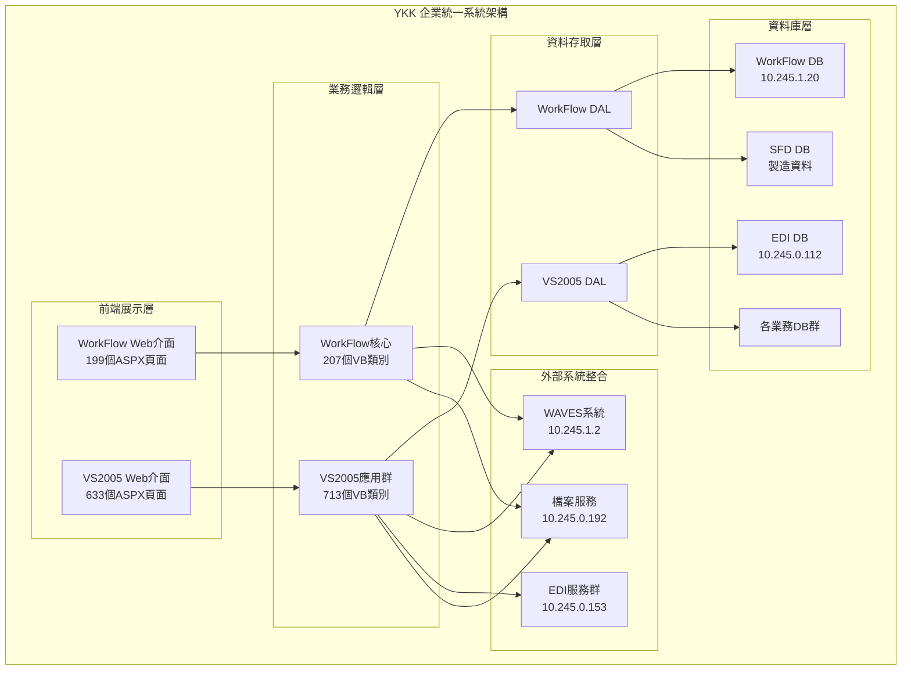

## 2. 統一業務架構

### 2.1 企業業務全景圖

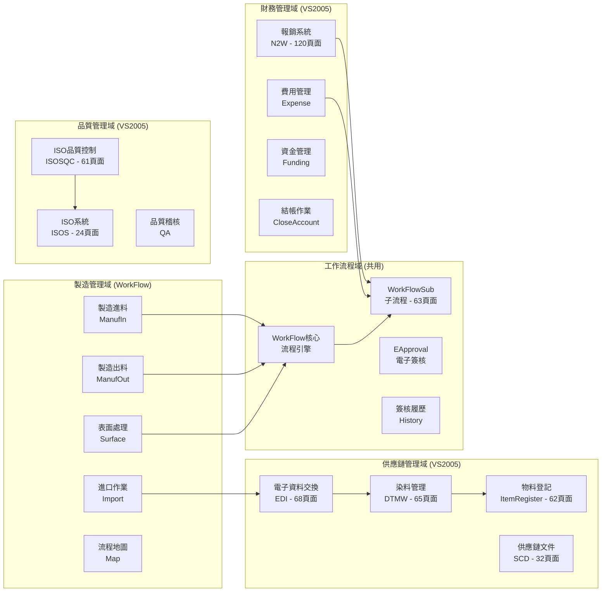

### 2.2 系統間資料流

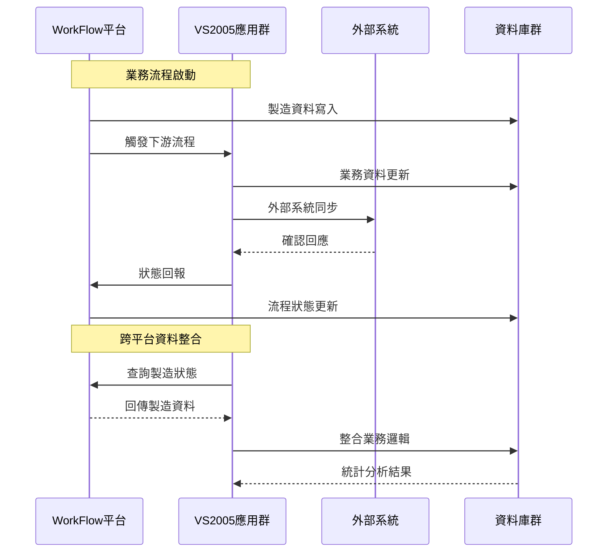

## 3. 技術架構統一分析

### 3.1 技術棧演進

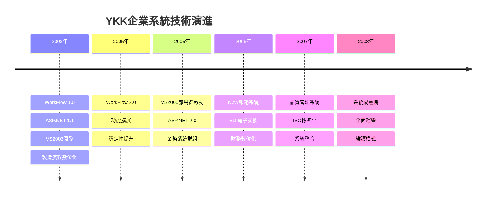

### 3.2 統一技術特徵

#### 程式語言統一性
- **主語言：** VB.NET (100%)
- **前端技術：** ASP.NET Web Forms
- **資料庫：** SQL Server 全系列
- **認證方式：** Windows 認證統一

#### 架構一致性
| 技術層面 | WorkFlow | VS2005 | 一致性評分 |
|----------|----------|---------|-----------|
| 開發框架 | .NET 1.1 | .NET 2.0 | ★★★★☆ |
| 資料存取 | ADO.NET | ADO.NET | ★★★★★ |
| 前端控制項 | Web Forms | Web Forms | ★★★★★ |
| 安全模型 | Windows Auth | Windows Auth | ★★★★★ |
| 部署方式 | IIS 6.0 | IIS 6.0 | ★★★★★ |

### 3.3 系統複雜度矩陣

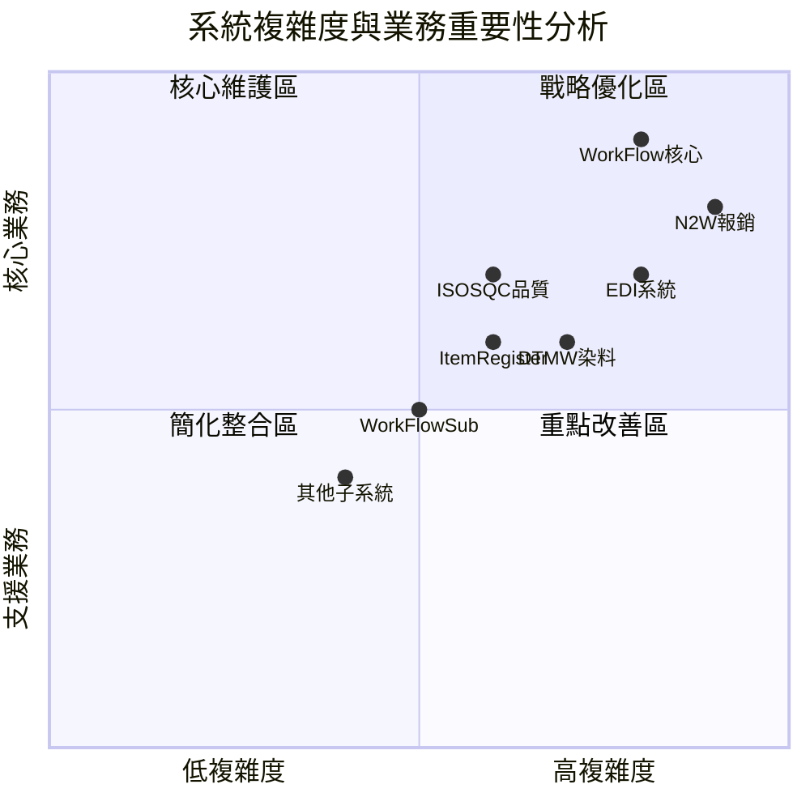

## 4. 統一資料架構

### 4.1 企業資料全景

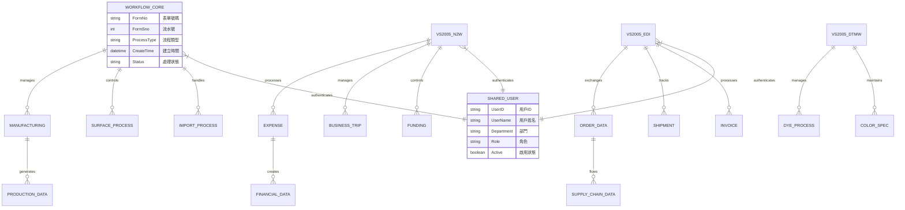

### 4.2 跨系統資料整合點

| 整合點 | WorkFlow | VS2005 | 整合方式 | 資料流向 |
|--------|----------|---------|----------|----------|
| **用戶認證** | Windows Auth | Windows Auth | AD統一認證 | 雙向同步 |
| **製造資料** | 生產流程 | N2W報銷 | 製造成本 | WorkFlow→N2W |
| **採購資料** | 進口流程 | EDI系統 | 採購訂單 | WorkFlow→EDI |
| **品質資料** | 表面處理 | ISOSQC | 品質記錄 | WorkFlow→ISOSQC |
| **物料資料** | 製造BOM | ItemRegister | 物料主檔 | 雙向同步 |
| **財務資料** | 成本核算 | N2W系統 | 成本分攤 | WorkFlow→N2W |

## 5. 統一功能架構

### 5.1 功能模組全景圖

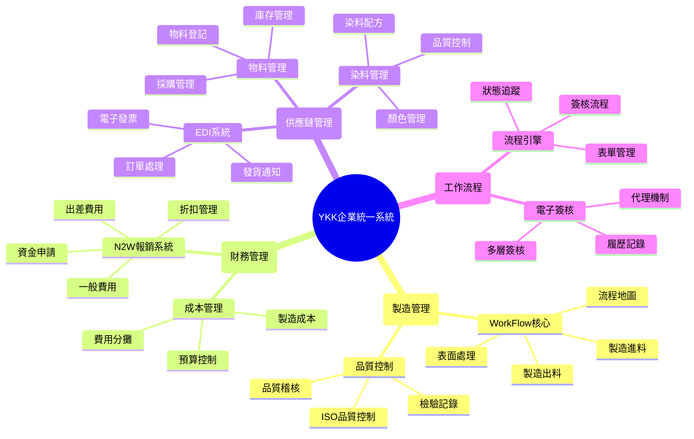

### 5.2 核心功能統計

#### 按平台分類
| 功能域 | WorkFlow頁面 | VS2005頁面 | 總頁面 | 業務佔比 |
|--------|--------------|------------|--------|----------|
| **製造管理** | 199 | 65 (DTMW) | 264 | 31.7% |
| **財務管理** | 0 | 120 (N2W) | 120 | 14.4% |
| **供應鏈管理** | 50 | 162 (EDI等) | 212 | 25.5% |
| **品質管理** | 30 | 85 (ISO系統) | 115 | 13.8% |
| **工作流程** | 119 | 63 (Sub) | 182 | 21.9% |
| **其他系統** | 0 | 138 | 138 | 16.6% |

#### 按複雜度分類
| 複雜度等級 | 系統數量 | 頁面數量 | 維護難度 |
|------------|----------|----------|----------|
| **極高** | 2個 | 319頁面 | 專家級 |
| **高** | 6個 | 358頁面 | 資深級 |
| **中等** | 10個 | 155頁面 | 中級 |
| **低** | 7個 | 50頁面 | 初級 |

## 6. 詳細模組說明

### 6.1 WorkFlow平台核心模組

#### 6.1.1 WorkFlow核心引擎
**功能概述：** 企業工作流程管理的核心引擎，負責所有製造流程的自動化控制。

**主要功能：**
- **流程定義管理：** 支援圖形化流程設計，可自定義各種製造流程
- **表單管理：** 提供動態表單生成，支援多種表單控制項
- **簽核流程：** 多層級簽核機制，支援條件式路由
- **狀態追蹤：** 即時監控流程進度，提供完整的狀態歷史
- **工作分派：** 自動任務分派與提醒機制

**技術特徵：**
- **檔案數量：** 920個檔案
- **網頁數量：** 199個ASPX頁面  
- **程式檔案：** 207個VB.NET類別
- **資料庫：** WorkFlow DB (10.245.1.20) + SFD DB

**核心子模組：**

##### ManufIn (製造進料模組)
- **用途：** 管理製造過程中的原料進料流程
- **功能：** 物料清單管理、進料檢驗、庫存更新
- **表單：** 進料申請單、檢驗報告單、異常處理單

##### ManufOut (製造出料模組)  
- **用途：** 控制製造過程的成品出料流程
- **功能：** 生產排程、品質檢驗、出貨管理
- **表單：** 出料申請單、品質檢驗單、包裝清單

##### Surface (表面處理模組)
- **用途：** 專門處理產品表面處理的特殊工藝流程
- **功能：** 表面處理工藝管理、參數控制、品質標準
- **表單：** 處理工藝單、參數設定單、品質記錄單

##### Import (進口作業模組)
- **用途：** 管理進口物料的流程與文件處理
- **功能：** 進口申請、海關文件、稅務處理
- **表單：** 進口申請單、海關申報單、稅務處理單

##### Map (流程地圖模組)
- **用途：** 提供視覺化的流程地圖與導航功能
- **功能：** 流程圖形化顯示、狀態可視化、路徑分析
- **界面：** 圖形化流程編輯器、狀態監控面板

### 6.2 VS2005應用群詳細模組

#### 6.2.1 財務管理模組群

##### N2W (報銷系統) - 120個頁面
**功能概述：** 企業費用報銷與財務管理的核心系統。

**主要功能模組：**
- **出差費用管理**
  - 出差申請與審批
  - 交通費、住宿費自動計算
  - 里程費率管理
  - 匯率自動轉換

- **一般費用報銷**  
  - 多類型費用分類
  - 發票影像上傳
  - 自動會計科目分派
  - 預算控制機制

- **折扣管理**
  - 供應商折扣談判記錄
  - 折扣率階梯管理
  - 自動折扣計算
  - 折扣效益分析

- **資金申請**
  - 資金需求預測
  - 多層級審批流程
  - 資金用途追蹤
  - 償還計畫管理

**技術特徵：**
- **頁面數：** 120個ASPX頁面 (系統中最大)
- **整合性：** 與WorkFlow製造成本深度整合
- **資料庫：** 獨立財務資料庫

#### 6.2.2 供應鏈管理模組群

##### EDI (電子資料交換) - 68個頁面
**功能概述：** 與供應商和客戶進行電子資料交換的核心平台。

**主要功能：**
- **訂單處理**
  - EDI 850 (採購訂單) 接收處理
  - EDI 855 (訂單確認) 自動回覆
  - 訂單狀態即時同步
  - 異常訂單處理機制

- **發貨通知**
  - EDI 856 (預先發貨通知) 生成
  - 貨物追蹤資訊整合
  - 運輸商資料交換
  - 到貨確認自動化

- **電子發票**
  - EDI 810 (發票) 自動生成
  - 多種稅務格式支援
  - 發票狀態追蹤
  - 付款條件管理

**技術特徵：**
- **頁面數：** 68個ASPX頁面
- **資料庫：** EDI DB (10.245.0.112)
- **外部整合：** EDI服務群 (10.245.0.153)

##### DTMW (染料管理) - 65個頁面
**功能概述：** 專門管理染料配方、顏色標準化的專業系統。

**主要功能：**
- **染料配方管理**
  - 配方版本控制
  - 配方成本計算
  - 配方效果預測
  - 配方優化建議

- **顏色管理**
  - 標準色卡管理
  - 色差檢測與分析
  - 顏色匹配算法
  - 客戶色樣管理

- **品質控制**
  - 染色品質標準
  - 批次品質追蹤
  - 品質異常分析
  - 改善措施記錄

**技術特徵：**
- **頁面數：** 65個ASPX頁面
- **專業性：** 紡織業特化功能
- **整合性：** 與Surface表面處理模組關聯

##### ItemRegister (物料登記) - 62個頁面
**功能概述：** 企業物料主檔管理與登記系統。

**主要功能：**
- **物料基本資料**
  - 物料編碼規則管理
  - 物料規格標準化
  - 供應商資訊關聯
  - 替代物料管理

- **庫存管理**
  - 即時庫存追蹤
  - 安全庫存預警
  - 庫存週轉分析
  - 呆滯物料管理

- **採購管理**
  - 採購申請流程
  - 供應商評估
  - 採購價格歷史
  - 採購績效分析

**技術特徵：**
- **頁面數：** 62個ASPX頁面
- **整合性：** 與WorkFlow製造BOM雙向同步

##### SCD (供應鏈文件) - 32個頁面
**功能概述：** 供應鏈相關文件的管理與流通平台。

**主要功能：**
- **文件管理**
  - 合約文件管理
  - 品質認證文件
  - 技術規格文件
  - 檢驗報告文件

- **文件流通**
  - 文件版本控制
  - 文件簽核流程
  - 文件分享權限
  - 文件到期提醒

#### 6.2.3 品質管理模組群

##### ISOSQC (ISO品質控制) - 61個頁面
**功能概述：** 基於ISO標準的品質控制管理系統。

**主要功能：**
- **品質標準管理**
  - ISO 9001 標準流程
  - 品質手冊管理
  - 標準作業程序
  - 品質目標設定

- **檢驗管理**
  - 進料檢驗標準
  - 製程檢驗控制
  - 最終檢驗程序
  - 檢驗結果統計

- **不合格品管理**
  - 不合格品識別
  - 原因分析機制
  - 改善措施追蹤
  - 預防措施實施

- **稽核管理**
  - 內部稽核排程
  - 稽核檢查清單
  - 稽核結果記錄
  - 矯正措施追蹤

**技術特徵：**
- **頁面數：** 61個ASPX頁面
- **標準化：** 嚴格遵循ISO標準
- **整合性：** 與WorkFlow品質資料關聯

##### ISOS (ISO系統) - 24個頁面
**功能概述：** ISO管理系統的基礎平台與設定功能。

**主要功能：**
- **系統設定**
  - ISO標準參數設定
  - 品質政策管理
  - 組織架構設定
  - 權責分工定義

- **文件控制**
  - 文件編號系統
  - 文件發行控制
  - 文件變更管理
  - 文件廢止程序

#### 6.2.4 工作流程模組群

##### WorkFlowSub (子流程系統) - 63個頁面
**功能概述：** 支援主WorkFlow系統的子流程管理平台。

**主要功能：**
- **子流程定義**
  - 標準子流程樣板
  - 子流程參數設定
  - 子流程組合邏輯
  - 子流程效能監控

- **流程整合**
  - 主子流程銜接
  - 資料傳遞機制
  - 狀態同步管理
  - 異常處理機制

##### EApproval (電子簽核) - 22個頁面
**功能概述：** 企業電子簽核的統一平台。

**主要功能：**
- **簽核流程**
  - 多層級簽核設定
  - 條件式簽核路由
  - 代理簽核機制
  - 簽核時限控制

- **簽核管理**
  - 簽核權限管理
  - 簽核歷史記錄
  - 簽核統計分析
  - 簽核效率監控

#### 6.2.5 其他業務模組

##### DASW (代理商系統) - 26個頁面
**功能概述：** 代理商關係管理與業務協作平台。

**主要功能：**
- **代理商管理**
  - 代理商基本資料
  - 代理區域管理
  - 代理權限設定
  - 代理績效考核

- **業務協作**
  - 訂單協作處理
  - 庫存資訊共享
  - 促銷活動管理
  - 客戶服務協作

##### StockInOut (庫存進出) - 27個頁面
**功能概述：** 庫存進出管理的專門系統。

**主要功能：**
- **進出管理**
  - 入庫作業管理
  - 出庫作業管理
  - 庫存調撥作業
  - 盤點作業管理

- **庫存控制**
  - 庫存水位監控
  - 庫存異常警示
  - 庫存成本分析
  - 庫存週轉報告

##### MPM (製造計畫管理) - 28個頁面
**功能概述：** 製造計畫與排程管理系統。

**主要功能：**
- **生產計畫**
  - 主生產計畫
  - 物料需求計畫
  - 產能計畫
  - 生產排程

- **計畫執行**
  - 計畫下達
  - 進度追蹤
  - 異常處理
  - 計畫調整

##### FAS (固定資產) - 18個頁面
**功能概述：** 企業固定資產管理系統。

**主要功能：**
- **資產管理**
  - 資產登記
  - 資產異動
  - 資產盤點
  - 資產處分

- **折舊管理**
  - 折舊計算
  - 折舊調整
  - 折舊報表
  - 稅務申報

##### 3S (三S系統) - 8個頁面
**功能概述：** 企業三S管理的基礎系統。

**主要功能：**
- **整理 (Seiri)**
  - 物品分類管理
  - 不需要物品清理
  - 工作環境整理

- **整頓 (Seiton)**
  - 物品定位管理
  - 標識系統
  - 取用效率優化

- **清掃 (Seiso)**
  - 清掃標準制定
  - 清掃責任分工
  - 清掃檢查記錄

##### ARMail (AR郵件) - 29個頁面
**功能概述：** 應收帳款相關的郵件通知與管理系統。

**主要功能：**
- **帳款通知**
  - 帳款到期提醒
  - 催收通知
  - 付款確認
  - 對帳通知

- **郵件管理**
  - 郵件範本管理
  - 郵件發送記錄
  - 郵件回應追蹤
  - 郵件效果分析

##### edLink (電子連結) - 40個頁面
**功能概述：** 企業內外部系統電子化連結平台。

**主要功能：**
- **系統整合**
  - API介面管理
  - 資料格式轉換
  - 系統間認證
  - 連結狀態監控

- **資料交換**
  - 批次資料傳輸
  - 即時資料同步
  - 資料驗證機制
  - 異常處理流程

### 6.3 模組間整合關係

#### 6.3.1 核心整合架構

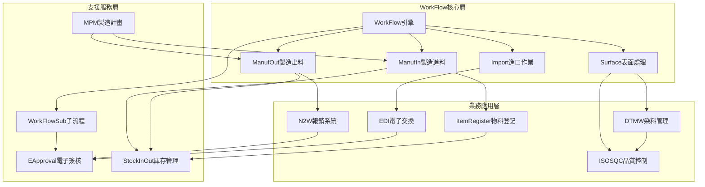

#### 6.3.2 資料流整合

| 來源模組 | 目標模組 | 資料類型 | 整合方式 | 更新頻率 |
|----------|----------|----------|----------|----------|
| WorkFlow | N2W | 製造成本資料 | 即時同步 | 每筆交易 |
| ManufIn | ItemRegister | 進料資料 | 批次同步 | 每日 |
| ManufOut | StockInOut | 出料資料 | 即時同步 | 每筆交易 |
| Surface | DTMW | 表面處理參數 | 即時同步 | 每次處理 |
| Import | EDI | 進口訂單資料 | 批次同步 | 每日 |
| ISOSQC | WorkFlow | 品質檢驗結果 | 即時同步 | 每次檢驗 |
| MPM | WorkFlow | 生產計畫 | 批次同步 | 每週 |

## 7. 統一部署架構

### 7.1 實體部署全景

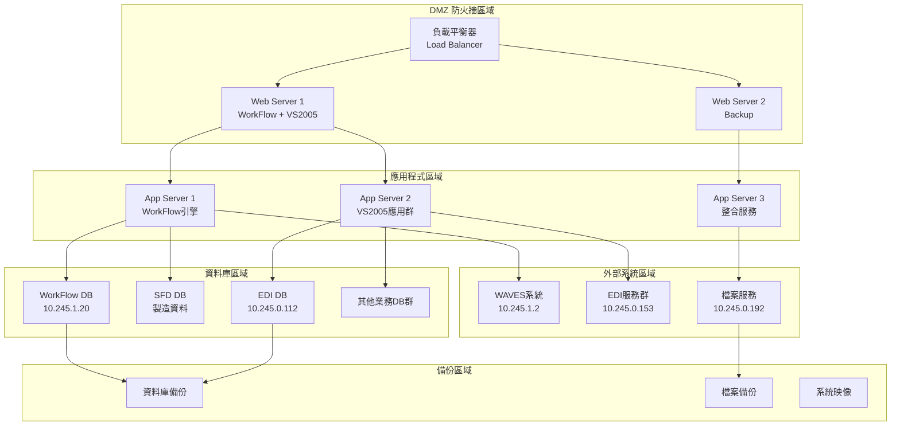

### 7.2 網路架構與安全

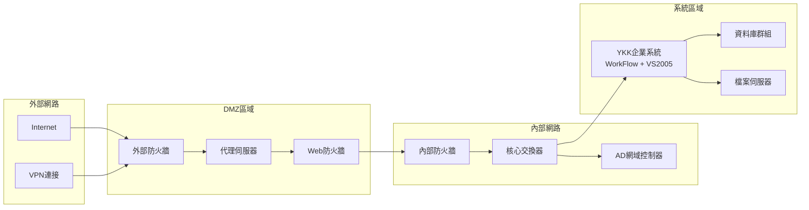

## 8. 統一安全架構

### 8.1 多層安全防護

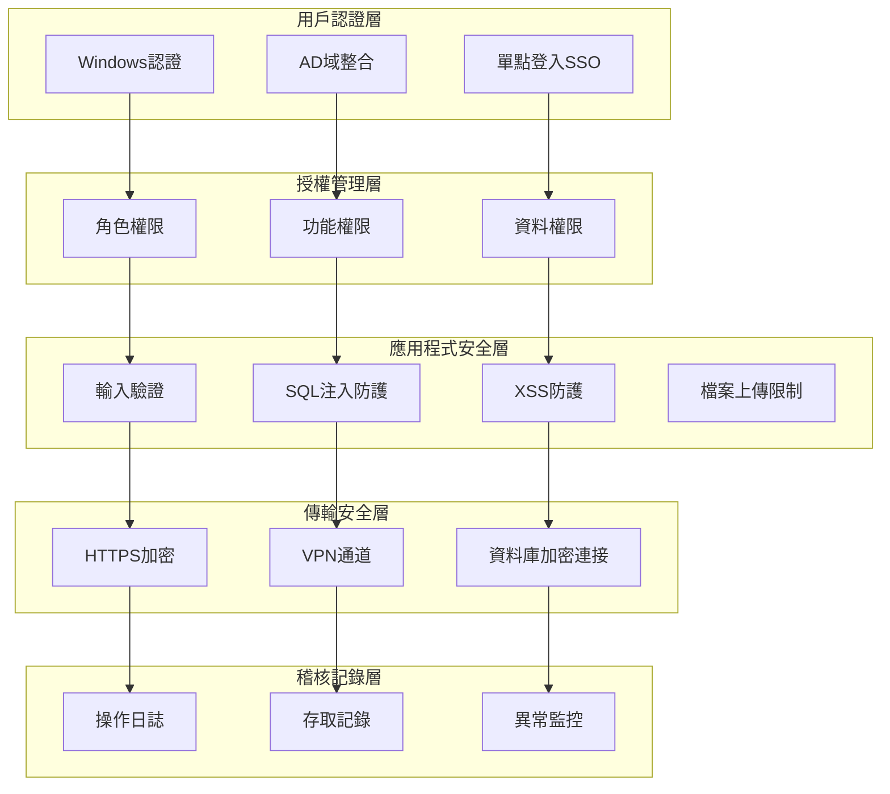

### 8.2 統一安全策略

| 安全層級 | WorkFlow | VS2005 | 統一策略 |
|----------|----------|---------|----------|
| **認證** | Windows認證 | Windows認證 | AD統一認證 |
| **授權** | 角色型權限 | 角色型權限 | RBAC模型 |
| **資料保護** | DB加密 | DB加密 | TDE透明加密 |
| **傳輸加密** | SSL/TLS | SSL/TLS | HTTPS強制 |
| **稽核記錄** | 操作日誌 | 操作日誌 | 集中化日誌 |

## 9. 維護與監控統一策略

### 9.1 統一監控架構

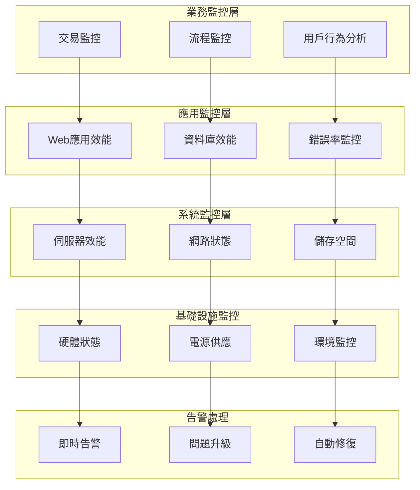

### 9.2 維護策略

#### 預防性維護
- **每日檢查：** 系統日誌、錯誤率、效能指標
- **每週檢查：** 資料庫維護、備份驗證、安全掃描
- **每月檢查：** 效能調校、容量規劃、安全更新
- **每季檢查：** 災難復原演練、架構檢視

#### 故障處理流程
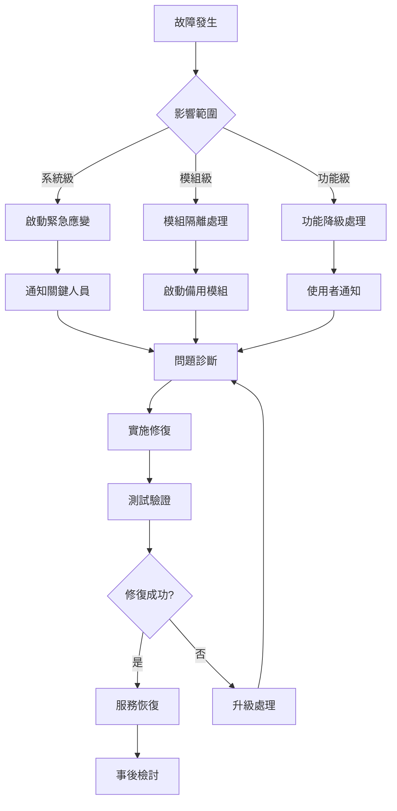

## 9. 總結與建議

### 9.1 系統統一性評估

| 評估維度 | 統一程度 | 評分 | 說明 |
|----------|----------|------|------|
| **業務連續性** | 高度統一 | ★★★★★ | 涵蓋完整業務鏈 |
| **技術一致性** | 中度統一 | ★★★★☆ | 框架版本不同但相容 |
| **資料整合性** | 中度統一 | ★★★☆☆ | 部分系統獨立運作 |
| **用戶體驗** | 高度統一 | ★★★★☆ | Web Forms一致性 |
| **維護效率** | 中度統一 | ★★★☆☆ | 技術棧分散 |

### 9.2 關鍵成功因素

1. **業務完整性：** 兩系統形成完整的企業數位化生態
2. **技術相容性：** .NET技術棧保證系統間相容性
3. **資料流通性：** 關鍵業務資料可跨系統流通
4. **運維統一性：** 可採用統一的維運管理策略

### 9.3 最終建議

#### 短期行動 (0-6個月)
1. **統一監控平台：** 建立跨系統的統一監控
2. **安全性強化：** 統一安全政策和防護措施
3. **效能優化：** 針對關鍵模組進行效能調優
4. **備份統一：** 建立統一的備份和災難復原策略

#### 中期規劃 (6-18個月)
1. **API整合層：** 建立統一的API層促進系統整合
2. **資料標準化：** 統一跨系統的資料格式和交換標準
3. **用戶體驗統一：** 建立統一的用戶介面和操作體驗
4. **核心系統升級：** 優先升級關鍵業務系統

---

**系統定位：** YKK 企業數位化核心骨幹  
**戰略重要性：** 企業營運不可或缺的基礎設施  
**升級迫切性：** 技術債務需要盡快處理  
**投資價值：** 高回報的長期戰略投資  

**文件版本：** v1.0  
**編製日期：** 2025年01月24日  
**下次檢視：** 2025年07月24日  
**文件狀態：** 統一規格完成 