# YKK 企業統一系統 - 整合規格書

## 1. 系統總覽

### 1.1 系統定義
YKK 企業統一系統是一個完整的企業資源規劃 (ERP) 生態系統，由兩大核心平台組成：
- **WorkFlow 平台** (VS2003基礎) - 製造流程管理核心
- **VS2005 應用群** (VS2005基礎) - 企業業務管理套件

這兩個平台共同構成了 YKK 企業的數位化營運骨幹，涵蓋從製造流程到財務管理的完整業務鏈。

### 1.2 系統規模總計

| 指標 | WorkFlow平台 | VS2005應用群 | 系統總計 |
|------|--------------|--------------|----------|
| **總檔案數** | 920個 | 2,762個 | **3,682個** |
| **網頁檔案** | 199個 | 633個 | **832個** |
| **程式檔案** | 207個 | 713個 | **920個** |
| **子系統數** | 1個核心 | 24個子系統 | **25個模組** |
| **開發時程** | 2003-2005 | 2005-2008 | 2003-2008 |

### 1.3 技術架構統一視圖

```mermaid
graph TB
    subgraph "YKK 企業統一系統架構"
        subgraph "前端展示層"
            A1[WorkFlow Web介面<br/>199個ASPX頁面]
            A2[VS2005 Web介面<br/>633個ASPX頁面]
        end
        
        subgraph "業務邏輯層"
            B1[WorkFlow核心<br/>207個VB類別]
            B2[VS2005應用群<br/>713個VB類別]
        end
        
        subgraph "資料存取層"
            C1[WorkFlow DAL]
            C2[VS2005 DAL]
        end
        
        subgraph "資料庫層"
            D1[WorkFlow DB<br/>10.245.1.20]
            D2[SFD DB<br/>製造資料]
            D3[EDI DB<br/>10.245.0.112]
            D4[各業務DB群]
        end
        
        subgraph "外部系統整合"
            E1[WAVES系統<br/>10.245.1.2]
            E2[EDI服務群<br/>10.245.0.153]
            E3[檔案服務<br/>10.245.0.192]
        end
    end
    
    A1 --> B1
    A2 --> B2
    B1 --> C1
    B2 --> C2
    C1 --> D1
    C1 --> D2
    C2 --> D3
    C2 --> D4
    B1 --> E1
    B2 --> E1
    B2 --> E2
    B1 --> E3
    B2 --> E3
```



## 2. 統一業務架構

### 2.1 企業業務全景圖


### 2.2 系統間資料流


## 3. 技術架構統一分析

### 3.1 技術棧演進


### 3.2 統一技術特徵

#### 程式語言統一性
- **主語言：** VB.NET (100%)
- **前端技術：** ASP.NET Web Forms
- **資料庫：** SQL Server 全系列
- **認證方式：** Windows 認證統一

#### 架構一致性
| 技術層面 | WorkFlow | VS2005 | 一致性評分 |
|----------|----------|---------|-----------|
| 開發框架 | .NET 1.1 | .NET 2.0 | ★★★★☆ |
| 資料存取 | ADO.NET | ADO.NET | ★★★★★ |
| 前端控制項 | Web Forms | Web Forms | ★★★★★ |
| 安全模型 | Windows Auth | Windows Auth | ★★★★★ |
| 部署方式 | IIS 6.0 | IIS 6.0 | ★★★★★ |

### 3.3 系統複雜度矩陣


## 4. 統一資料架構

### 4.1 企業資料全景


### 4.2 跨系統資料整合點

| 整合點 | WorkFlow | VS2005 | 整合方式 | 資料流向 |
|--------|----------|---------|----------|----------|
| **用戶認證** | Windows Auth | Windows Auth | AD統一認證 | 雙向同步 |
| **製造資料** | 生產流程 | N2W報銷 | 製造成本 | WorkFlow→N2W |
| **採購資料** | 進口流程 | EDI系統 | 採購訂單 | WorkFlow→EDI |
| **品質資料** | 表面處理 | ISOSQC | 品質記錄 | WorkFlow→ISOSQC |
| **物料資料** | 製造BOM | ItemRegister | 物料主檔 | 雙向同步 |
| **財務資料** | 成本核算 | N2W系統 | 成本分攤 | WorkFlow→N2W |

## 5. 統一功能架構

### 5.1 功能模組全景圖


### 5.2 核心功能統計

#### 按平台分類
| 功能域 | WorkFlow頁面 | VS2005頁面 | 總頁面 | 業務佔比 |
|--------|--------------|------------|--------|----------|
| **製造管理** | 199 | 65 (DTMW) | 264 | 31.7% |
| **財務管理** | 0 | 120 (N2W) | 120 | 14.4% |
| **供應鏈管理** | 50 | 162 (EDI等) | 212 | 25.5% |
| **品質管理** | 30 | 85 (ISO系統) | 115 | 13.8% |
| **工作流程** | 119 | 63 (Sub) | 182 | 21.9% |
| **其他系統** | 0 | 138 | 138 | 16.6% |

#### 按複雜度分類
| 複雜度等級 | 系統數量 | 頁面數量 | 維護難度 |
|------------|----------|----------|----------|
| **極高** | 2個 | 319頁面 | 專家級 |
| **高** | 6個 | 358頁面 | 資深級 |
| **中等** | 10個 | 155頁面 | 中級 |
| **低** | 7個 | 50頁面 | 初級 |

## 6. 統一部署架構

### 6.1 實體部署全景


### 6.2 網路架構與安全


## 7. 統一安全架構

### 7.1 多層安全防護


### 7.2 統一安全策略

| 安全層級 | WorkFlow | VS2005 | 統一策略 |
|----------|----------|---------|----------|
| **認證** | Windows認證 | Windows認證 | AD統一認證 |
| **授權** | 角色型權限 | 角色型權限 | RBAC模型 |
| **資料保護** | DB加密 | DB加密 | TDE透明加密 |
| **傳輸加密** | SSL/TLS | SSL/TLS | HTTPS強制 |
| **稽核記錄** | 操作日誌 | 操作日誌 | 集中化日誌 |

## 8. 統一效能分析

### 8.1 系統效能基準

```mermaid
xychart-beta
    title "系統效能指標對比"
    x-axis [同時用戶數, 平均回應時間, 每日交易量, 系統可用性]
    y-axis "指標值" 0 --> 20000
    bar [100, 2.5, 5000, 99.5]
    bar [300, 2.0, 15000, 99.2]
    bar [400, 2.2, 20000, 99.3]
```

### 8.2 效能瓶頸分析

| 效能指標 | 目前狀態 | 瓶頸點 | 改善建議 |
|----------|----------|--------|----------|
| **CPU使用率** | 65-80% | 業務邏輯處理 | 程式碼優化 |
| **記憶體使用** | 70-85% | ViewState過大 | 狀態管理優化 |
| **資料庫效能** | 中等 | 查詢未優化 | 索引調整 |
| **網路頻寬** | 30-50% | 大檔案傳輸 | 壓縮技術 |
| **磁碟I/O** | 60-75% | 日誌寫入 | SSD升級 |

### 8.3 擴展策略


## 9. 維護與監控統一策略

### 9.1 統一監控架構


### 9.2 維護策略

#### 預防性維護
- **每日檢查：** 系統日誌、錯誤率、效能指標
- **每週檢查：** 資料庫維護、備份驗證、安全掃描
- **每月檢查：** 效能調校、容量規劃、安全更新
- **每季檢查：** 災難復原演練、架構檢視

#### 故障處理流程


## 10. 現代化升級路徑

### 10.1 技術債務統一評估

| 債務類型 | WorkFlow | VS2005 | 統一風險等級 | 處理優先級 |
|----------|----------|---------|--------------|------------|
| **框架老舊** | .NET 1.1 | .NET 2.0 | 極高 | P0 |
| **安全漏洞** | 中等 | 中等 | 高 | P1 |
| **效能問題** | 中等 | 中高 | 高 | P1 |
| **維護困難** | 高 | 中高 | 高 | P2 |
| **擴展限制** | 高 | 中等 | 中高 | P2 |

### 10.2 分階段現代化策略


### 10.3 目標技術架構


## 11. 投資回報分析

### 11.1 現代化投資估算

| 投資項目 | 第一年 | 第二年 | 第三年 | 總投資 |
|----------|--------|--------|--------|--------|
| **人力成本** | 800萬 | 1200萬 | 1000萬 | 3000萬 |
| **技術授權** | 200萬 | 300萬 | 200萬 | 700萬 |
| **硬體設備** | 500萬 | 300萬 | 200萬 | 1000萬 |
| **雲端服務** | 100萬 | 200萬 | 300萬 | 600萬 |
| **顧問服務** | 300萬 | 200萬 | 100萬 | 600萬 |
| **總計** | **1900萬** | **2200萬** | **1800萬** | **5900萬** |

### 11.2 效益分析


| 效益項目 | 年效益估算 | 3年累計效益 |
|----------|------------|-------------|
| **維護成本降低** | 600萬/年 | 1800萬 |
| **開發效率提升** | 400萬/年 | 1200萬 |
| **安全風險降低** | 300萬/年 | 900萬 |
| **業務流程優化** | 500萬/年 | 1500萬 |
| **創新業務機會** | 200萬/年 | 600萬 |
| **總效益** | **2000萬/年** | **6000萬** |

**投資回報率 (ROI)：** 6000萬 ÷ 5900萬 = **102%**  
**投資回收期：** 約 **3年**

## 12. 總結與建議

### 12.1 系統統一性評估

| 評估維度 | 統一程度 | 評分 | 說明 |
|----------|----------|------|------|
| **業務連續性** | 高度統一 | ★★★★★ | 涵蓋完整業務鏈 |
| **技術一致性** | 中度統一 | ★★★★☆ | 框架版本不同但相容 |
| **資料整合性** | 中度統一 | ★★★☆☆ | 部分系統獨立運作 |
| **用戶體驗** | 高度統一 | ★★★★☆ | Web Forms一致性 |
| **維護效率** | 中度統一 | ★★★☆☆ | 技術棧分散 |

### 12.2 關鍵成功因素

1. **業務完整性：** 兩系統形成完整的企業數位化生態
2. **技術相容性：** .NET技術棧保證系統間相容性
3. **資料流通性：** 關鍵業務資料可跨系統流通
4. **運維統一性：** 可採用統一的維運管理策略

### 12.3 最終建議

#### 短期行動 (0-6個月)
1. **統一監控平台：** 建立跨系統的統一監控
2. **安全性強化：** 統一安全政策和防護措施
3. **效能優化：** 針對關鍵模組進行效能調優
4. **備份統一：** 建立統一的備份和災難復原策略

#### 中期規劃 (6-18個月)
1. **API整合層：** 建立統一的API層促進系統整合
2. **資料標準化：** 統一跨系統的資料格式和交換標準
3. **用戶體驗統一：** 建立統一的用戶介面和操作體驗
4. **核心系統升級：** 優先升級關鍵業務系統

#### 長期願景 (18-36個月)
1. **微服務化改造：** 將單體系統拆分為微服務架構
2. **雲端化部署：** 遷移到現代雲端基礎設施
3. **智能化升級：** 整合AI/ML技術提升業務智能
4. **全面現代化：** 達成技術棧全面現代化

---

**系統定位：** YKK 企業數位化核心骨幹  
**戰略重要性：** 企業營運不可或缺的基礎設施  
**升級迫切性：** 技術債務需要盡快處理  
**投資價值：** 高回報的長期戰略投資  

**文件版本：** v1.0  
**編製日期：** 2025年01月24日  
**下次檢視：** 2025年07月24日  
**文件狀態：** 統一規格完成 