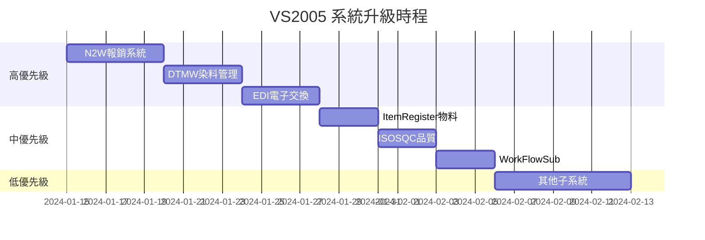
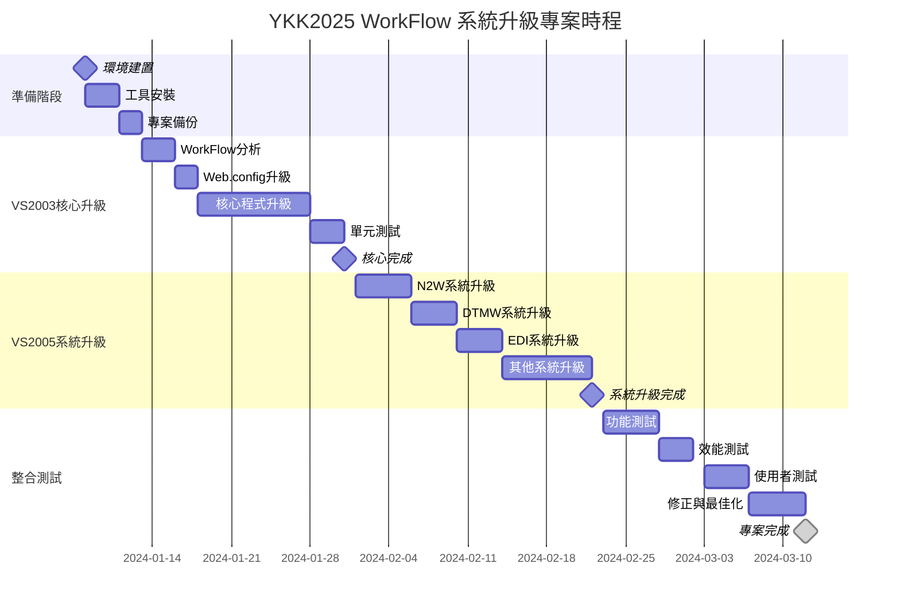

# YKK2025 WorkFlow 系統升級計畫書
**從 .NET Framework 1.1/2.0 升級到 .NET Framework 4.8**  
**從 Visual Studio 2003/2005 升級到 Visual Studio 2022**

---

## 📋 專案概述

### 系統現況分析
- **總計 VB.NET 檔案**: 925 個程式檔案
- **主要系統架構**:
  - **VS2003 WorkFlow 系統** (路徑: `YKK2025/VS2003/VS2003/WorkFlow`)
  - **VS2005 子系統群組** (路徑: `YKK2025/VS2005/VS2005/*`)
- **現有技術棧**:
  - .NET Framework 1.1 (VS2003)
  - .NET Framework 2.0 (VS2005)
  - ASP.NET Web Forms
  - VB.NET 程式語言
  - SQL Server 資料庫

### 升級目標
- **目標框架**: .NET Framework 4.8
- **開發工具**: Visual Studio 2022
- **保持相容性**: 維持現有功能與使用者體驗
- **提升效能**: 利用新框架的最佳化功能
- **增強安全性**: 採用現代安全機制

---

## 🔍 技術債務深度分析

### 1. VS2003 WorkFlow 系統 (核心系統)

#### 檔案結構分析
```
WorkFlow/
├── Web.config (286行) - 使用 .NET 1.1 配置語法
├── 核心表單檔案 (85個 .aspx/.aspx.vb)
│   ├── ManufOutSheet_01.aspx.vb (7,910行) ⚠️ 超大檔案
│   ├── ManufInSheet_01.aspx.vb (6,745行) ⚠️ 超大檔案
│   ├── SufaceSheet_01.aspx.vb (4,774行)
│   ├── ImportCTSheet_01.aspx.vb (1,931行)
│   └── MapModSheet_01.aspx.vb (2,597行)
├── Document/ (文件管理)
├── Images/ (圖片資源)
├── Sheet/ (報表模組)
└── bin/ (編譯檔案)
```

#### 技術問題識別

**A. 程式碼層面**
- ❌ 使用舊版 `System.Web.UI.Page` 語法
- ❌ `Inherits System.Web.UI.Page` 無 Partial Class
- ❌ `Protected WithEvents` 大量使用舊版控制項宣告
- ❌ `<System.Diagnostics.DebuggerStepThrough()>` 舊版屬性語法
- ❌ VB.NET 語法不符合現代標準

**B. Web.config 問題**
```xml
<!-- 問題示例 -->
<compilation defaultLanguage="vb" debug="false"/>  <!-- 缺少 targetFramework -->
<authentication mode="Windows"/>  <!-- 舊版驗證模式 -->
<sessionState mode="InProc" timeout="20"/>  <!-- 無現代配置 -->
```

**C. 資料庫連線問題**
```xml
<!-- 使用舊版 OLE DB Provider -->
<add key="SqlConn" value="Provider=SQLOLEDB.1;Data Source=10.245.1.20;..."/>
```

### 2. VS2005 系統群組分析

#### 系統分布
| 系統代碼 | 系統名稱 | 檔案數 | 主要功能 |
|---------|---------|-------|---------|
| N2W | 報銷系統 | 243 | 費用報銷管理 |
| DTMW | 染料管理 | 128 | 染色工藝管理 |
| EDI | 電子資料交換 | 139 | EDI 資料處理 |
| ItemRegister | 物料登記 | 130 | 物料資訊管理 |
| ISOSQC | 品質控制 | 124 | ISO 品質管理 |
| WorkFlowSub | 工作流程子系統 | 133 | 流程支援 |
| EApproval | 電子簽核 | 22 | 簽核流程 |
| ISOS | ISO 系統 | 50 | ISO 標準管理 |
| 其他子系統 | 15個系統 | 493 | 各種業務功能 |

#### VS2005 特有問題
- ✅ 已使用 `Partial Class` 語法
- ❌ .NET Framework 2.0 語法限制
- ❌ 缺少現代 C# 特性支援
- ❌ 安全性機制過時

---

## 📈 升級策略與階段規劃

### 階段一：基礎環境準備 (1-2 週)

#### 1.1 開發環境建置
```powershell
# 安裝清單
- Visual Studio 2022 Professional/Enterprise
- .NET Framework 4.8 Developer Pack
- SQL Server Management Studio (最新版)
- Git 版控系統
- 程式碼分析工具 (SonarQube/CodeQL)
```

#### 1.2 專案備份與版控
```bash
# 建立完整備份
git init
git add .
git commit -m "Initial backup before .NET 4.8 upgrade"
git tag "pre-upgrade-backup"
```

#### 1.3 相依性分析工具
```xml
<!-- 安裝分析套件 -->
<PackageReference Include="Microsoft.DotNet.Analyzers.Compatibility" />
<PackageReference Include="Microsoft.CodeAnalysis.FxCopAnalyzers" />
```

### 階段二：核心 WorkFlow 系統升級 (3-4 週)

#### 2.1 Web.config 現代化

**升級前 (VS2003)**
```xml
<configuration>
  <system.web>
    <compilation defaultLanguage="vb" debug="false"/>
    <authentication mode="Windows"/>
  </system.web>
</configuration>
```

**升級後 (.NET 4.8)**
```xml
<configuration>
  <system.web>
    <compilation defaultLanguage="vb" debug="false" targetFramework="4.8"/>
    <httpRuntime targetFramework="4.8" maxRequestLength="51200"/>
    <authentication mode="Windows"/>
    <machineKey validationKey="[AUTO_GENERATED]" decryptionKey="[AUTO_GENERATED]" validation="HMACSHA256" decryption="AES"/>
  </system.web>
  <runtime>
    <assemblyBinding xmlns="urn:schemas-microsoft-com:asm.v1">
      <!-- 新版組件重定向 -->
    </assemblyBinding>
  </runtime>
</configuration>
```

#### 2.2 VB.NET 程式碼現代化

**升級模式範例 - ManufOutSheet_01.aspx.vb**

**升級前 (VS2003)**
```vb
Public Class ManufOutSheet_01
    Inherits System.Web.UI.Page

    Protected WithEvents DManuaInSheet2 As System.Web.UI.WebControls.Image
    Protected WithEvents DDescSheet As System.Web.UI.WebControls.Image
    
    <System.Diagnostics.DebuggerStepThrough()> Private Sub InitializeComponent()
    End Sub
End Class
```

**升級後 (.NET 4.8)**
```vb
Imports System.ComponentModel
Imports System.Web.Security
Imports System.Web.UI.WebControls

Partial Public Class ManufOutSheet_01
    Inherits System.Web.UI.Page

    Protected DManuaInSheet2 As Image
    Protected DDescSheet As Image
    
    ' 現代化錯誤處理
    Protected Sub Page_Error(sender As Object, e As EventArgs) Handles Me.Error
        ' 統一錯誤處理機制
    End Sub
    
    ' 非同步支援
    Protected Async Sub ProcessDataAsync()
        ' 非同步資料處理
    End Sub
End Class
```

#### 2.3 資料存取層升級

**升級前 (OLE DB)**
```vb
Dim conn As New OleDbConnection(ConfigurationSettings.AppSettings("SqlConn"))
```

**升級後 (SqlClient + 連線池)**
```vb
Imports System.Data.SqlClient
Imports System.Configuration

' 使用現代連線字串配置
Private ReadOnly Property ConnectionString As String
    Get
        Return ConfigurationManager.ConnectionStrings("WorkFlowDB").ConnectionString
    End Get
End Property

' 使用 Using 語句確保資源釋放
Using conn As New SqlConnection(ConnectionString)
    ' 資料存取邏輯
End Using
```

### 階段三：VS2005 系統群組升級 (4-5 週)

#### 3.1 系統升級優先序


#### 3.2 每個子系統升級檢查清單

**N2W 報銷系統升級**
- [ ] 升級專案檔 (.vbproj) 到 VS2022 格式
- [ ] 修正 Web.config targetFramework
- [ ] 更新 NuGet 套件參考
- [ ] 測試報銷流程完整性
- [ ] 驗證資料庫相容性

**DTMW 染料管理系統升級**
- [ ] 特殊注意染色配方計算邏輯
- [ ] 確保顏色管理功能正常
- [ ] 測試批次處理功能
- [ ] 驗證檔案上傳下載

### 階段四：整合測試與最佳化 (2-3 週)

#### 4.1 功能測試矩陣
| 測試項目 | VS2003 WorkFlow | N2W | DTMW | EDI | 其他系統 |
|---------|----------------|-----|------|-----|---------|
| 登入驗證 | ✅ | ✅ | ✅ | ✅ | ✅ |
| 表單提交 | ✅ | ✅ | ✅ | ✅ | ✅ |
| 檔案上傳 | ✅ | ✅ | ✅ | ✅ | ✅ |
| 報表產生 | ✅ | ✅ | ✅ | ✅ | ✅ |
| 工作流程 | ✅ | ✅ | ✅ | ✅ | ✅ |
| 資料查詢 | ✅ | ✅ | ✅ | ✅ | ✅ |

#### 4.2 效能最佳化
```vb
' 實作快取機制
<OutputCache(Duration:=300, VaryByParam:="id")>
Public Partial Class OptimizedPage
    Inherits System.Web.UI.Page
    
    ' 使用非同步方法
    Protected Async Function LoadDataAsync() As Task(Of DataSet)
        ' 非同步資料載入
    End Function
End Class
```

---

## ⚠️ 風險評估與緩解策略

### 高風險項目

#### 1. 大型程式檔案風險
**風險**: ManufOutSheet_01.aspx.vb (7,910行) 等超大檔案
**緩解**: 
- 段階式重構，分解為多個部分類別
- 建立詳細的功能對照表
- 實作自動化測試覆蓋

#### 2. 資料庫相容性風險
**風險**: 舊版 SQL 語法不相容
**緩解**:
- 全面 SQL 語法檢查
- 建立資料庫升級腳本
- 實作 rollback 機制

#### 3. 第三方元件風險
**風險**: 舊版控制項或組件無法使用
**緩解**:
- 提前識別所有第三方依賴
- 尋找現代替代方案
- 必要時自行開發替代組件

### 中風險項目

#### 1. 使用者介面變更
**風險**: 升級後 UI 行為改變
**緩解**: 
- CSS 樣式表統一管理
- 瀏覽器相容性測試
- 使用者接受度測試

#### 2. 效能影響
**風險**: 升級後系統效能下降
**緩解**:
- 建立效能基準測試
- 實作效能監控
- 程式碼最佳化

---

## 🛠️ 實作工具與技術規範

### 開發工具配置
```json
{
  "visualStudio": {
    "version": "2022",
    "edition": "Professional",
    "extensions": [
      "VB.NET Refactoring Tools",
      "Code Analysis",
      "Git Integration"
    ]
  },
  "targetFramework": "4.8",
  "languageVersion": "VB 16"
}
```

### 程式碼標準
```vb
' 新的程式碼標準範例
Option Strict On
Option Explicit On
Option Infer On

Imports System.Threading.Tasks
Imports System.Web.UI.WebControls

Namespace YKK.WorkFlow.Core
    Partial Public Class ModernPage
        Inherits System.Web.UI.Page
        
        ' 使用屬性而非欄位
        Protected ReadOnly Property UserID As String
            Get
                Return Session("UserID")?.ToString()
            End Get
        End Property
        
        ' 實作非同步方法
        Protected Async Function ProcessAsync() As Task
            ' 非同步處理邏輯
        End Function
        
        ' 現代錯誤處理
        Protected Sub HandleError(ex As Exception)
            ' 統一錯誤處理
        End Sub
    End Class
End Namespace
```

---

## 📊 專案排程與里程碑

### 詳細時程規劃



### 關鍵里程碑
- **Week 1**: 開發環境就緒 ✅
- **Week 4**: VS2003 核心系統升級完成 🎯
- **Week 7**: VS2005 主要系統升級完成 🎯
- **Week 9**: 整合測試完成 🎯
- **Week 10**: 專案交付 🏁

---

## 💰 資源需求與成本估算

### 人力資源配置
| 角色 | 人數 | 週數 | 工作內容 |
|------|------|------|---------|
| 資深 .NET 開發者 | 2 | 10 | 核心系統升級 |
| VB.NET 工程師 | 3 | 8 | 子系統升級 |
| 測試工程師 | 2 | 4 | 功能與整合測試 |
| 資料庫專家 | 1 | 6 | 資料庫升級與最佳化 |
| 專案經理 | 1 | 10 | 專案管理與協調 |

### 技術資源需求
- **開發伺服器**: Windows Server 2019 + IIS 10
- **測試環境**: 完整複製生產環境
- **開發工具授權**: Visual Studio 2022 x 5 套
- **第三方工具**: 程式碼分析工具、效能監控工具

### 詳細預算評估

#### 人力成本 (台幣)
| 角色 | 月薪 | 人數 | 專案週數 | 總工時 | 小計 |
|------|------|------|---------|--------|------|
| 資深 .NET 開發者 | NT$ 120,000 | 2 | 10 | 1,600 | NT$ 600,000 |
| VB.NET 工程師 | NT$ 85,000 | 3 | 8 | 1,920 | NT$ 510,000 |
| 測試工程師 | NT$ 70,000 | 2 | 4 | 640 | NT$ 140,000 |
| 資料庫專家 | NT$ 100,000 | 1 | 6 | 480 | NT$ 150,000 |
| 專案經理 | NT$ 130,000 | 1 | 10 | 800 | NT$ 325,000 |
| **人力成本小計** | | | | | **NT$ 1,725,000** |

#### 軟體授權成本 (台幣)
| 項目 | 單價 | 數量 | 年限 | 小計 |
|------|------|------|------|------|
| Visual Studio 2022 Professional | NT$ 45,000 | 5 | 1年 | NT$ 225,000 |
| Windows Server 2019 Standard | NT$ 35,000 | 2 | 永久 | NT$ 70,000 |
| SQL Server 2019 Standard | NT$ 80,000 | 1 | 永久 | NT$ 80,000 |
| SonarQube Developer Edition | NT$ 60,000 | 1 | 1年 | NT$ 60,000 |
| Git Enterprise (Azure DevOps) | NT$ 15,000 | 1 | 1年 | NT$ 15,000 |
| **軟體授權小計** | | | | **NT$ 450,000** |

#### 硬體設備成本 (台幣)
| 項目 | 規格 | 單價 | 數量 | 小計 |
|------|------|------|------|------|
| 開發工作站 | Intel i7-12700K, 32GB RAM, 1TB SSD | NT$ 60,000 | 5 | NT$ 300,000 |
| 測試伺服器 | Xeon E-2236, 64GB RAM, 2TB SSD | NT$ 150,000 | 2 | NT$ 300,000 |
| 網路設備升級 | Gigabit Switch + UPS | NT$ 30,000 | 1 | NT$ 30,000 |
| **硬體設備小計** | | | | **NT$ 630,000** |

#### 第三方服務成本 (台幣)
| 項目 | 說明 | 成本 |
|------|------|------|
| 程式碼審查顧問 | 外部 .NET 專家諮詢 (40 小時) | NT$ 160,000 |
| 安全性測試服務 | 滲透測試與安全檢測 | NT$ 80,000 |
| 效能測試工具 | LoadRunner 或 JMeter 專業版 | NT$ 50,000 |
| 備份與災難復原 | 雲端備份服務 (3個月) | NT$ 30,000 |
| 培訓課程 | .NET 4.8 + VS2022 團隊培訓 | NT$ 120,000 |
| **第三方服務小計** | | **NT$ 440,000** |

#### 風險緩衝成本 (台幣)
| 風險項目 | 機率 | 影響 | 緩衝成本 |
|---------|------|------|---------|
| 超大檔案重構延遲 | 60% | 高 | NT$ 200,000 |
| 第三方元件相容性問題 | 40% | 中 | NT$ 100,000 |
| 資料庫升級複雜度 | 30% | 中 | NT$ 80,000 |
| 使用者驗收測試延遲 | 50% | 中 | NT$ 150,000 |
| **風險緩衝小計** | | | **NT$ 530,000** |

#### 總預算彙總
```
┌─────────────────────────────────────────────┐
│               預算總覽                        │
├─────────────────────────────────────────────┤
│ 人力成本              NT$ 1,725,000 (44.7%) │
│ 軟體授權              NT$   450,000 (11.7%) │
│ 硬體設備              NT$   630,000 (16.3%) │
│ 第三方服務            NT$   440,000 (11.4%) │
│ 風險緩衝              NT$   530,000 (13.7%) │
├─────────────────────────────────────────────┤
│ 基礎預算小計          NT$ 3,245,000         │
│ 管理費用 (8%)         NT$   259,600         │
│ 營業稅 (5%)           NT$   175,230         │
├─────────────────────────────────────────────┤
│ 專案總預算            NT$ 3,679,830         │
└─────────────────────────────────────────────┘
```

#### 預算分期付款建議
| 階段 | 里程碑 | 付款比例 | 金額 |
|------|--------|---------|------|
| 專案啟動 | 合約簽署 | 20% | NT$ 735,966 |
| 環境建置完成 | 開發環境就緒 | 15% | NT$ 551,975 |
| 核心系統升級 | VS2003 WorkFlow 完成 | 30% | NT$ 1,103,949 |
| 系統群組升級 | VS2005 系統完成 | 25% | NT$ 919,958 |
| 專案交付 | 驗收測試通過 | 10% | NT$ 367,983 |

#### 成本效益分析

**直接效益 (年度，台幣)**
- 系統維護成本降低：NT$ 500,000
- 開發效率提升 (30%)：NT$ 800,000
- 安全性風險降低：NT$ 300,000
- 效能提升節省硬體成本：NT$ 200,000
- **年度直接效益**：NT$ 1,800,000

**間接效益 (年度，台幣)**
- 員工技能提升價值：NT$ 400,000
- 系統穩定性提升：NT$ 300,000
- 未來擴展性價值：NT$ 500,000
- 現代化品牌形象：NT$ 200,000
- **年度間接效益**：NT$ 1,400,000

**投資回收期計算**
```
總投資成本：NT$ 3,679,830
年度總效益：NT$ 3,200,000 (直接 + 間接)
投資回收期：1.15 年
```

#### 預算控制措施
1. **每週預算檢討會議**
   - 追蹤實際支出 vs 預算
   - 識別預算偏差風險
   - 調整資源分配

2. **階段性預算核准**
   - 每階段完成後審核下階段預算
   - 根據實際進度調整預算分配
   - 風險緩衝金的使用需經核准

3. **成本控制工具**
   - 專案管理軟體追蹤工時
   - 採購流程標準化
   - 定期供應商評估

#### 預算敏感性分析
| 變動因素 | -20% | -10% | 基準 | +10% | +20% |
|---------|------|------|------|------|------|
| 人力成本變動 | NT$ 3,334,830 | NT$ 3,507,330 | NT$ 3,679,830 | NT$ 3,852,330 | NT$ 4,024,830 |
| 專案時程變動 | NT$ 3,334,830 | NT$ 3,507,330 | NT$ 3,679,830 | NT$ 3,852,330 | NT$ 4,024,830 |
| 風險發生機率 | NT$ 3,573,830 | NT$ 3,626,830 | NT$ 3,679,830 | NT$ 3,732,830 | NT$ 3,785,830 |

---

## 🔍 品質保證與測試策略

### 測試金字塔
```
     /\
    /E2E\     ← 端到端測試 (10%)
   /____\
  /Integration\ ← 整合測試 (20%)
 /__________\
/Unit Tests   \ ← 單元測試 (70%)
\_____________/
```

### 自動化測試框架
```vb
' 單元測試範例
<TestClass>
Public Class WorkFlowTests
    <TestMethod>
    Public Sub TestManufOutSheet_DataValidation()
        ' 測試製造輸出表單資料驗證
        Dim sheet As New ManufOutSheet_01()
        Assert.IsTrue(sheet.ValidateFormData())
    End Sub
End Class
```

### 效能基準測試
- **頁面載入時間**: < 3 秒
- **表單提交響應**: < 1 秒
- **檔案上傳處理**: < 10 秒
- **報表產生時間**: < 30 秒
- **併發使用者支援**: 100+ 使用者

---

## 📋 交付清單與驗收標準

### 交付成果物
1. **升級後的完整原始碼**
   - 所有 925 個 VB.NET 檔案升級完成
   - 符合 .NET Framework 4.8 規範
   - 通過 Visual Studio 2022 編譯

2. **升級文件**
   - 詳細升級步驟記錄
   - 程式碼變更對照表
   - 新功能說明文件

3. **測試報告**
   - 功能測試完整報告
   - 效能測試基準報告
   - 相容性測試結果

4. **部署指南**
   - 生產環境部署步驟
   - Rollback 計畫
   - 監控與維護指南

### 驗收標準
- ✅ 所有原有功能正常運作
- ✅ 效能無明顯下降
- ✅ 新框架安全性特性已啟用
- ✅ 程式碼符合現代化標準
- ✅ 文件完整且易於理解

---

## 🚀 後續維護與演進建議

### 短期維護 (3-6 個月)
- 監控系統穩定性
- 修正發現的 bug
- 使用者回饋收集與處理

### 中期演進 (6-12 個月)
- 引入現代 UI 框架 (Bootstrap 5)
- 實作響應式設計
- 增強行動裝置支援

### 長期規劃 (1-2 年)
- 考慮遷移至 .NET 6/8
- 微服務架構重構
- 雲端部署策略

---

## 📞 專案聯絡資訊

**專案負責人**: [專案經理姓名]  
**技術負責人**: [技術主管姓名]  
**緊急聯絡**: [24小時支援電話]  

**專案 Git Repository**: `https://github.com/ykk2025/workflow-upgrade`  
**專案看板**: `https://ykk2025.atlassian.net/jira/software/projects/WFU`

---

*本計畫書版本: v1.0*  
*最後更新: 2024年1月*  
*下次審查: 專案啟動後每週五進行進度審查* 